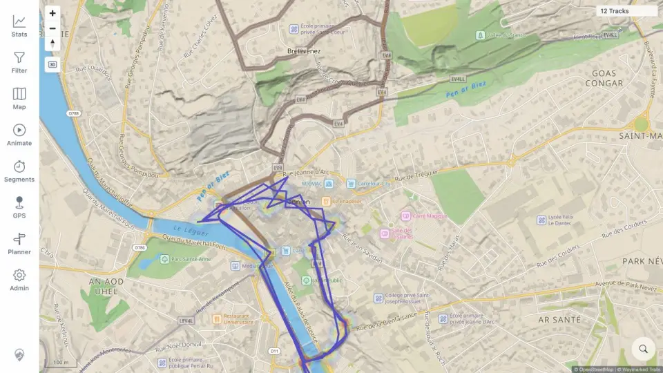

# Packet: HMO_02

## Scope

- Coverage source: [coverage-plan.md](../coverage-plan.md).
- Coverage ID or run packet: HMO_02.
- In scope: independent route-overlay toggles, opacity, and ordering.
- Out of scope: filter-driven heatmap refresh.

## Prerequisites

- Required previous coverage IDs or run packets: HMO_01.
- Required app/data state: tracks 100%, heatmap 40%, route overlays off.
- Required browser context: Lannion desktop map.

## Allowed Mutations

- Allowed: toggle each route overlay, change Cycling opacity, and restore all off.
- Not allowed: change base map source or track opacity.

## Actions And Results

| Coverage ID | Action | Expected result | Actual result | Status | Evidence |
|---|---|---|---|---|---|
| HMO_02 | Enabled/disabled each of seven worldwide/Swiss overlays independently, verified every opacity slider, and changed Cycling 100→40. | Overlays toggle independently; opacity works; ordering relative to tracks is correct. | Every layer reached 1/7 alone with its own slider. Cycling lightened at 40%, while blue tracks stayed readable above the network; all overlays restored off. | PASS | [ordering](../assets/HMO_02-overlays.webp), [matrix](../assets/HMO_02-overlays.txt) |

## Issues

No issue found.

## Evidence Files

| File | Purpose |
|---|---|
| [assets/HMO_02-overlays.webp](../assets/HMO_02-overlays.webp) | 40% Cycling network with user tracks visibly above it. |
| [assets/HMO_02-overlays.txt](../assets/HMO_02-overlays.txt) | Seven-layer independence and slider matrix. |

## Screenshot Evidence

## Timings

| Step | Timing |
|---|---:|
| Each independent toggle | < 0.3 s |
| Cycling opacity update | 0.4 s |

## Handoff Notes

- Completed: HMO_02 is terminal `PASS`.
- Remaining unfinished coverage: HMO_03 onward.
- Blocked or not applicable: none in this packet.
- State left for the next packet: all route overlays off; heatmap 40%; Map sheet open.
