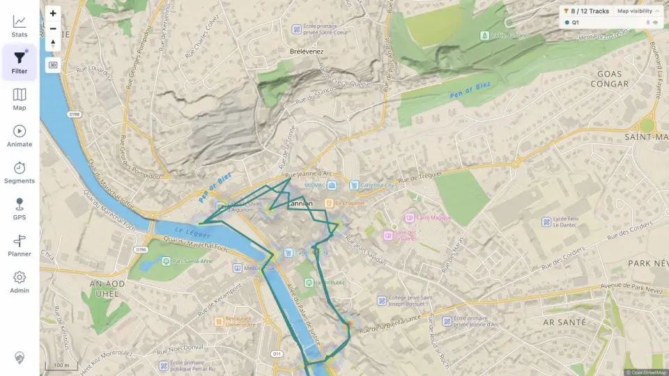

# Packet: HMO_03

## Scope

- Coverage source: [coverage-plan.md](../coverage-plan.md).
- Coverage ID or run packet: HMO_03.
- In scope: heatmap refresh after a filter change.
- Out of scope: broader filter semantics already covered by FLT.

## Prerequisites

- Required previous coverage IDs or run packets: HMO_02.
- Required app/data state: twelve-track heatmap at 40%, route overlays off.
- Required browser context: Lannion desktop map.

## Allowed Mutations

- Allowed: select exact Q1 and later restore filter state.
- Not allowed: change heatmap opacity during comparison.

## Actions And Results

| Coverage ID | Action | Expected result | Actual result | Status | Evidence |
|---|---|---|---|---|---|
| HMO_03 | Changed Smart Base Filter/all tracks to Tracks by quarter/Q1 only while keeping Heatmap at 40%. | Heatmap updates to the active filter. | Map and legend changed 12→8/Q1, and the density surface recalculated to the remaining Q1 geometry without excluded-branch residue. | PASS | [filtered heatmap](../assets/HMO_03-filtered-heatmap.webp), [transition](../assets/HMO_03-filtered-heatmap.txt), [baseline](../assets/HMO_01-heatmap.webp) |

## Issues

No issue found.

## Evidence Files

| File | Purpose |
|---|---|
| [assets/HMO_03-filtered-heatmap.webp](../assets/HMO_03-filtered-heatmap.webp) | Eight-track Q1 density and geometry. |
| [assets/HMO_03-filtered-heatmap.txt](../assets/HMO_03-filtered-heatmap.txt) | Baseline-to-Q1 comparison. |
| [assets/HMO_01-heatmap.webp](../assets/HMO_01-heatmap.webp) | Twelve-track baseline at the same opacity. |

## Screenshot Evidence

## Timings

| Step | Timing |
|---|---:|
| Filter and heatmap update | < 0.7 s |

## Handoff Notes

- Completed: HMO_03 is terminal `PASS`.
- Remaining unfinished coverage: GPS_01 onward.
- Blocked or not applicable: none in this packet.
- State left for the next packet: Q1 result 8/12, heatmap 40%, Lannion map.
