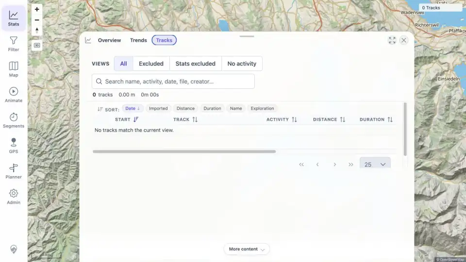
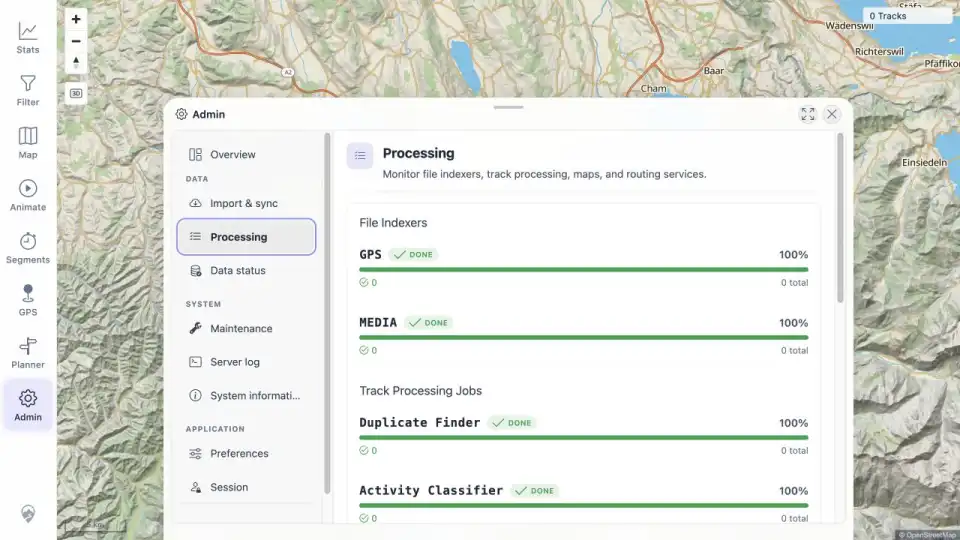

# Packet: IMP_01

## Scope

- Coverage source: [coverage-plan.md](../coverage-plan.md).
- Coverage ID or run packet: IMP_01.
- In scope: capture the empty pre-import map, track-browser, statistics, freshness, and GPS indexer baseline.
- Out of scope: import mutation.

## Prerequisites

- Required previous coverage IDs or run packets: DAT_01-DAT_07.
- Required app/data state: watched import folder empty; staged sources outside it.
- Required browser context: signed-in desktop in-app browser.

## Allowed Mutations

- Allowed: navigate among Stats and Admin views and save evidence.
- Not allowed: copy/upload source files or start indexing.

## Actions And Results

| Coverage ID | Action | Expected result | Actual result | Status | Evidence |
|---|---|---|---|---|---|
| IMP_01 | Verified the watched folder was empty; inspected map count, Stats Overview/Tracks, Admin Data status technical details, and Admin Processing. | A complete pre-import baseline records map/browser/stats totals, freshness token, and settled GPS indexer state. | Map and browser show 0 tracks, 0.00 m, 0m 00s; Stats has no tracks; server/client freshness tokens match with index/tracks/geometry/media revisions 0; GPS and all processing jobs are done at 0/0. | PASS | [assets/IMP_01-baseline.txt](../assets/IMP_01-baseline.txt); [assets/IMP_01-track-browser-baseline.webp](../assets/IMP_01-track-browser-baseline.webp); [assets/IMP_01-processing-baseline.webp](../assets/IMP_01-processing-baseline.webp) |

## Issues

| ID | Severity | Summary | Reproduction | Expected | Actual | Evidence | Release impact |
|---|---|---|---|---|---|---|---|

## Evidence Files

| File | Purpose |
|---|---|
| [assets/IMP_01-baseline.txt](../assets/IMP_01-baseline.txt) | Exact pre-import counts, freshness tokens/revisions, and indexer/job status. |
| [assets/IMP_01-track-browser-baseline.webp](../assets/IMP_01-track-browser-baseline.webp) | Empty track-browser baseline. |
| [assets/IMP_01-processing-baseline.webp](../assets/IMP_01-processing-baseline.webp) | Settled 0/0 processing baseline. |

## Screenshot Evidence

## Timings

| Step | Timing |
|---|---:|
| Baseline UI navigation and capture | 3 min |

## Handoff Notes

- Completed: direct empty-state baseline across all required surfaces.
- Remaining unfinished coverage: IMP_02 onward and deferred DAT_03 mapping.
- Blocked or not applicable: none.
- State left for the next packet: browser on Stats > Tracks; watched folder still empty; all jobs settled.
