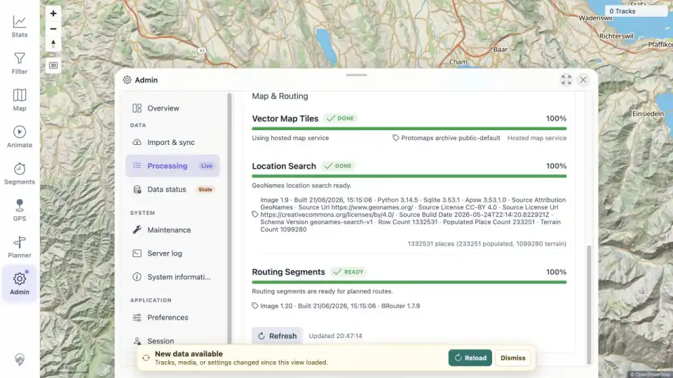

# Packet: IMP_03

## Scope

- Coverage source: [coverage-plan.md](../coverage-plan.md).
- Coverage ID or run packet: IMP_03.
- In scope: wait for automatic GPX indexing and determine whether manual Rescan GPS is needed.
- Out of scope: final background-job settlement and client data reload.

## Prerequisites

- Required previous coverage IDs or run packets: IMP_02.
- Required app/data state: five files freshly present in the watched folder.
- Required browser context: signed-in desktop Admin Processing view.

## Allowed Mutations

- Allowed: refresh processing status and wait for automatic watcher/index completion.
- Not allowed: trigger Rescan GPS unless the live watcher fails to react.

## Actions And Results

| Coverage ID | Action | Expected result | Actual result | Status | Evidence |
|---|---|---|---|---|---|
| IMP_03 | Observed server live-watcher detection for all five filenames, waited for five successful ingest completions, and refreshed Admin Processing without invoking Rescan GPS. | Indexing finishes automatically, or Rescan GPS is used and recorded only if watching fails. | The watcher detected all five creates, all five ingests completed successfully within 18.171 s, and Admin showed GPS done 5/5. No manual rescan was needed. The stale-data banner appeared as expected. | PASS | [assets/IMP_03-indexing.txt](../assets/IMP_03-indexing.txt); [assets/IMP_03-indexing.webp](../assets/IMP_03-indexing.webp) |

## Issues

| ID | Severity | Summary | Reproduction | Expected | Actual | Evidence | Release impact |
|---|---|---|---|---|---|---|---|

## Evidence Files

| File | Purpose |
|---|---|
| [assets/IMP_03-indexing.txt](../assets/IMP_03-indexing.txt) | Watcher detection, successful ingest IDs/timestamps, duration, and rescan decision. |
| [assets/IMP_03-indexing.webp](../assets/IMP_03-indexing.webp) | Admin Processing with GPS 5/5 and new-data state. |

## Screenshot Evidence

## Timings

| Step | Timing |
|---|---:|
| Watcher detection to final GPX ingest | 18.171 s |

## Handoff Notes

- Completed: automatic five-file watcher/indexing path; no manual rescan.
- Remaining unfinished coverage: IMP_04 onward and deferred DAT_03 mapping.
- Blocked or not applicable: none.
- State left for the next packet: GPS indexer done 5/5; Activity Classifier and Exploration Score were still running at capture; client freshness is stale with Reload available.
