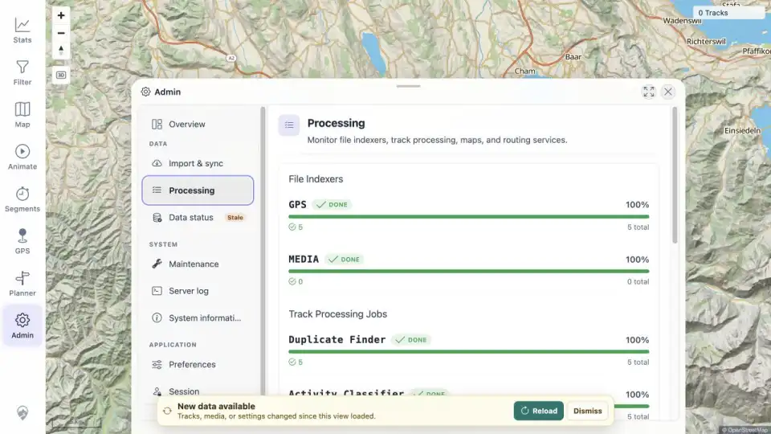

# Packet: IMP_04

## Scope

- Coverage source: [coverage-plan.md](../coverage-plan.md).
- Coverage ID or run packet: IMP_04.
- In scope: confirm all five imports complete without unexpected GPS failures, freshness changes, and processing jobs settle.
- Out of scope: applying the client Reload action.

## Prerequisites

- Required previous coverage IDs or run packets: IMP_03.
- Required app/data state: GPS indexer has processed five files; client remains stale.
- Required browser context: signed-in desktop Admin views.

## Allowed Mutations

- Allowed: wait, refresh Admin Processing/Data status, and inspect the new-data banner.
- Not allowed: select Reload before capturing the stale state.

## Actions And Results

| Coverage ID | Action | Expected result | Actual result | Status | Evidence |
|---|---|---|---|---|---|
| IMP_04 | Waited for processing to settle; refreshed Admin Processing; compared baseline/post-import revision tokens; verified the stale-data banner without reloading. | Five sources complete, no unexpected GPS failures, freshness changes, and Duplicate Finder/Exploration Score settle. | GPS completed 5/5 with no failure state. Duplicate Finder, Activity Classifier, and Exploration Score all reached done 5/5. Server index/geometry/tracks revisions changed from 0/0/0 to 15/30/30, Data status was Out of sync, and the New data available banner was visible. | PASS | [assets/IMP_04-status.txt](../assets/IMP_04-status.txt); [assets/IMP_04-settled.webp](../assets/IMP_04-settled.webp) |

## Issues

| ID | Severity | Summary | Reproduction | Expected | Actual | Evidence | Release impact |
|---|---|---|---|---|---|---|---|

## Evidence Files

| File | Purpose |
|---|---|
| [assets/IMP_04-status.txt](../assets/IMP_04-status.txt) | Settled job counts and before/after freshness tokens. |
| [assets/IMP_04-settled.webp](../assets/IMP_04-settled.webp) | Settled Processing view with stale-data state. |

## Screenshot Evidence

## Timings

| Step | Timing |
|---|---:|
| Final job settlement after observed GPS completion | < 2 min |

## Handoff Notes

- Completed: five imports and all background jobs are settled; freshness changed and client is intentionally stale.
- Remaining unfinished coverage: IMP_05 onward and deferred DAT_03 mapping.
- Blocked or not applicable: none.
- State left for the next packet: New data available banner with Reload is visible; map still shows stale `0 Tracks` until Reload.
