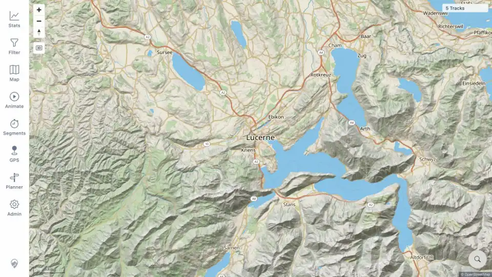
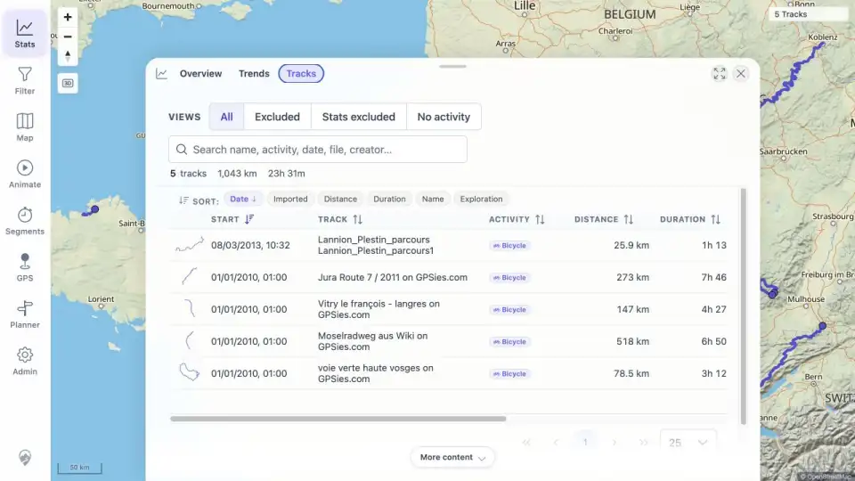
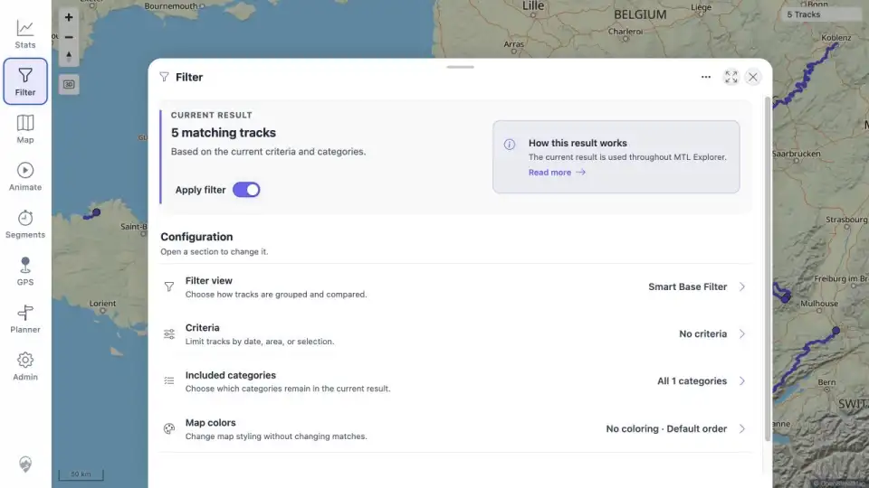
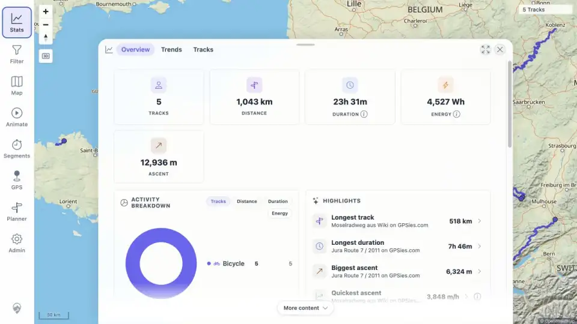

# Packet: IMP_05

> **FIX FOLLOW-UP — 2026-08-14: FIXED AND VERIFIED.** The original beta failure below is retained as run history. See [follow-up evidence](../fix-verification.md#resolution-matrix).

## Scope

- Coverage source: [coverage-plan.md](../coverage-plan.md).
- Coverage ID or run packet: IMP_05.
- In scope: use the freshness-banner Reload action and verify map, track browser, filter, and statistics all show the imported data.
- Out of scope: per-file name searches and map interactions.

## Prerequisites

- Required previous coverage IDs or run packets: IMP_04.
- Required app/data state: server has five settled imports; client is stale with Reload available.
- Required browser context: signed-in desktop browser that loaded the empty dataset before import.

## Allowed Mutations

- Allowed: click Reload, navigate among map/filter/stats/browser, close/reopen sheets, and perform one recovery browser reload after preserving failure evidence.
- Not allowed: reset the filter or change server data to hide the stale result.

## Actions And Results

| Coverage ID | Action | Expected result | Actual result | Status | Evidence |
|---|---|---|---|---|---|
| IMP_05 | Clicked the New data available Reload action, then directly checked map, Filter, Statistics Overview, and Statistics > Tracks; closed/reopened Filter; inspected console logs; finally performed a normal browser reload to test recovery. | The helper Reload synchronizes map, track browser, filters, and statistics to the five imported tracks without a full browser restart/reload. | Map and Track Browser updated to five tracks, but Filter remained `No tracks match` and Stats Overview showed `0 of 5`; reopening did not recover and console logs were empty. A normal browser reload recovered Filter to `5 matching tracks` and Stats to five tracks. | FAIL | [assets/IMP_05-reload-result.txt](../assets/IMP_05-reload-result.txt); [assets/IMP_05-map.webp](../assets/IMP_05-map.webp); [assets/IMP_05-track-browser.webp](../assets/IMP_05-track-browser.webp); [assets/IMP_05-filter-after-normal-reload.webp](../assets/IMP_05-filter-after-normal-reload.webp); [assets/IMP_05-stats-after-normal-reload.webp](../assets/IMP_05-stats-after-normal-reload.webp) |

## Issues

| ID | Severity | Summary | Reproduction | Expected | Actual | Evidence | Release impact |
|---|---|---|---|---|---|---|---|
| IMP-05-P1 | P1 | Freshness Reload leaves Filter and Statistics at zero after the first five-track import. | On a fresh empty install, keep the browser open; import five GPX files; wait for all jobs; click the New data available Reload action; open Filter and Stats Overview; close/reopen Filter. | Map, browser, filter, and statistics all resolve the five imported tracks immediately. | Map and Track Browser show five, while Filter says `No tracks match` and Stats says `0 of 5`; only a normal browser reload recovers both to five. | [assets/IMP_05-reload-result.txt](../assets/IMP_05-reload-result.txt) | Blocks the documented seamless import-refresh flow and makes core statistics/filter results appear empty until the user reloads the page. |

## Evidence Files

| File | Purpose |
|---|---|
| [assets/IMP_05-reload-result.txt](../assets/IMP_05-reload-result.txt) | Exact failing sequence, empty-console check, and recovery sequence. |
| [assets/IMP_05-map.webp](../assets/IMP_05-map.webp) | Map showing five tracks after helper Reload. |
| [assets/IMP_05-track-browser.webp](../assets/IMP_05-track-browser.webp) | Track Browser showing five imported rows. |
| [assets/IMP_05-filter-after-normal-reload.webp](../assets/IMP_05-filter-after-normal-reload.webp) | Filter recovered to five matching tracks only after normal reload. |
| [assets/IMP_05-stats-after-normal-reload.webp](../assets/IMP_05-stats-after-normal-reload.webp) | Statistics recovered to five tracks only after normal reload. |

## Screenshot Evidence

## Timings

| Step | Timing |
|---|---:|
| Helper Reload to settled map | 4 s |
| Reopen/wait stale Filter | 3 s |
| Normal reload to recovered Stats | 3 s |

## Handoff Notes

- Completed: required helper-reload cross-surface check; IMP-05-P1 recorded; normal reload recovery verified.
- Remaining unfinished coverage: IMP_06 onward and deferred DAT_03 mapping.
- Blocked or not applicable: none.
- State left for the next packet: recovered, synchronized five-track browser state; Stats > Tracks open.
