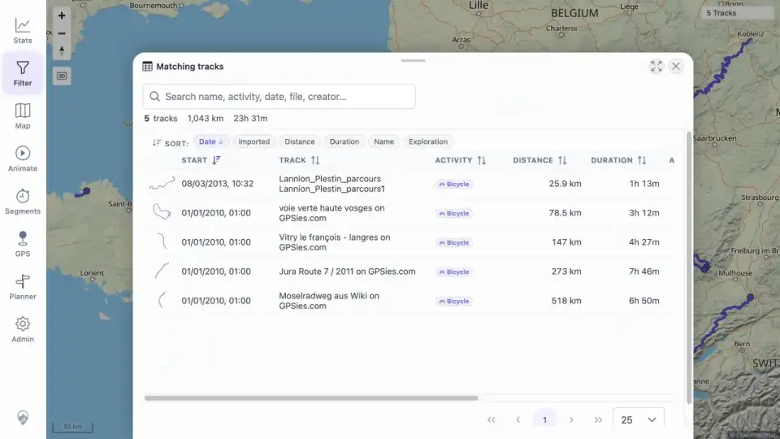

# Packet: IMP_06

## Scope

- Coverage source: [coverage-plan.md](../coverage-plan.md).
- Coverage ID or run packet: IMP_06.
- In scope: verify every imported GPX by filename/name in Track Browser search, map, Statistics, and at least one Filter result.
- Out of scope: detailed geometry quality and point popups.

## Prerequisites

- Required previous coverage IDs or run packets: IMP_05.
- Required app/data state: recovered synchronized five-track state after normal reload.
- Required browser context: signed-in desktop browser.

## Allowed Mutations

- Allowed: search filenames, open/close map details, select overlap rows, and open Filter Review tracks.
- Not allowed: edit or delete tracks.

## Actions And Results

| Coverage ID | Action | Expected result | Actual result | Status | Evidence |
|---|---|---|---|---|---|
| IMP_06 | Searched every exact filename in Statistics > Tracks; clicked each corresponding main-map geometry (including the Vosges/Mosel overlap selection); checked Statistics Overview/Recent Activity; opened Filter > Review tracks. | Every imported file is searchable by name and appears on map, in statistics summaries, and in at least one filter result. | All five filename searches returned exactly one named row; map clicks opened IDs 100000-100004 with matching names; Stats Recent Activity includes all five; the five-track Filter result and Review tracks list include all five rows. | PASS | [assets/IMP_06-file-verification.txt](../assets/IMP_06-file-verification.txt); [assets/IMP_06-map-all.webp](../assets/IMP_06-map-all.webp); [assets/IMP_06-filter-review.webp](../assets/IMP_06-filter-review.webp) |

## Issues

| ID | Severity | Summary | Reproduction | Expected | Actual | Evidence | Release impact |
|---|---|---|---|---|---|---|---|

## Evidence Files

| File | Purpose |
|---|---|
| [assets/IMP_06-file-verification.txt](../assets/IMP_06-file-verification.txt) | Per-file search, ID/name, direct map, Stats, and Filter verification. |
| [assets/IMP_06-map-all.webp](../assets/IMP_06-map-all.webp) | All five imported map geometries in the full fitted extent. |
| [assets/IMP_06-filter-review.webp](../assets/IMP_06-filter-review.webp) | Filter current result and matching-track rows. |

## Screenshot Evidence

## Timings

| Step | Timing |
|---|---:|
| Five filename searches | 8 s |
| Five direct map checks | 3 min |
| Stats and Filter verification | 2 min |

## Handoff Notes

- Completed: five GPX source-to-ID/name mappings and all four required UI surfaces.
- Remaining unfinished coverage: IMP_07 onward; DAT_03 still needs the FIT imported mapping.
- Blocked or not applicable: none.
- State left for the next packet: Filter Review tracks is open with all five rows; no filter restriction active.
