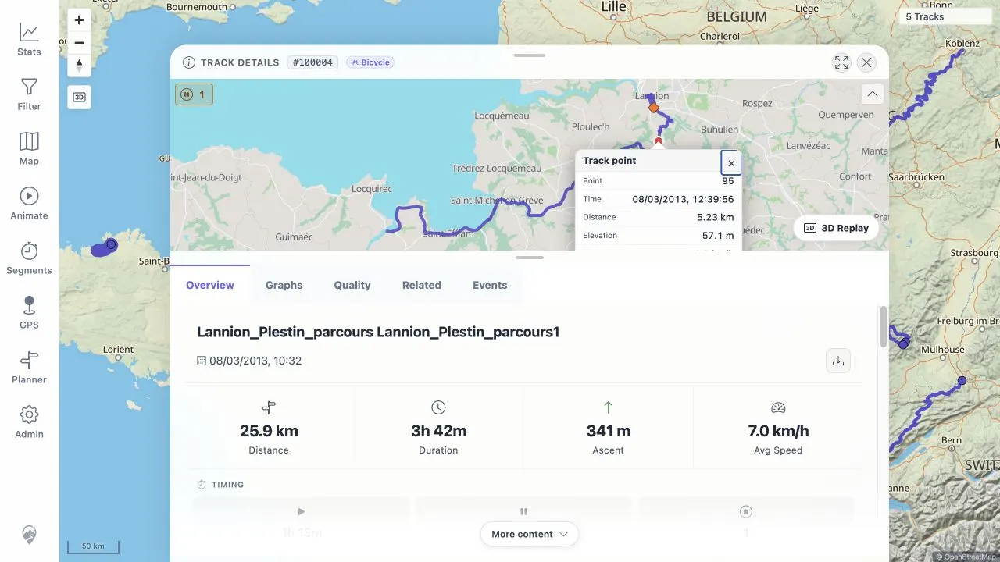

# Packet: IMP_07

## Scope

- Coverage source: [coverage-plan.md](../coverage-plan.md).
- Coverage ID or run packet: IMP_07.
- In scope: zoom to imported tracks; click each track; verify selection/detail opening, point popups, visible line geometry, and no stale or duplicate lines.
- Out of scope: aggregate statistics and later map feature coverage.

## Prerequisites

- Required previous coverage IDs or run packets: IMP_06.
- Required app/data state: synchronized five-track GPX state with no filter restrictions.
- Required browser context: signed-in desktop browser.

## Allowed Mutations

- Allowed: change map viewport, select tracks, open/close details, and click visible detail-map lines.
- Not allowed: edit, delete, or import tracks.

## Actions And Results

| Coverage ID | Action | Expected result | Actual result | Status | Evidence |
|---|---|---|---|---|---|
| IMP_07 | Fitted the five-track map extent, clicked each imported geometry, opened each matching detail, inspected each fitted detail line, and clicked a visible point on every detail map. | Every track opens its matching detail; each line is visible and interactive; point popups work; no stale or duplicate lines appear. | IDs 100000-100004 all opened the matching details. Every fitted detail line opened a Track point popup with point/time/distance/elevation/speed/elapsed data. Route changes left one matching continuous line, with no stale or duplicate line. The known Mosel/Vosges overlap produced a valid two-track chooser. | PASS | [assets/IMP_07-map-detail-verification.txt](../assets/IMP_07-map-detail-verification.txt); [assets/IMP_07-point-popup.webp](../assets/IMP_07-point-popup.webp); [assets/IMP_06-map-all.webp](../assets/IMP_06-map-all.webp) |

## Issues

| ID | Severity | Summary | Reproduction | Expected | Actual | Evidence | Release impact |
|---|---|---|---|---|---|---|---|

## Evidence Files

| File | Purpose |
|---|---|
| [assets/IMP_07-map-detail-verification.txt](../assets/IMP_07-map-detail-verification.txt) | Per-track selection, detail line, point-popup, and stale/duplicate-line checks. |
| [assets/IMP_07-point-popup.webp](../assets/IMP_07-point-popup.webp) | Track detail map with a populated point popup. |
| [assets/IMP_06-map-all.webp](../assets/IMP_06-map-all.webp) | Fitted main-map extent with all five imported routes. |

## Screenshot Evidence

## Timings

| Step | Timing |
|---|---:|
| Five detail-map and point-popup checks | 6 min |
| Stale and duplicate line review | 1 min |

## Handoff Notes

- Completed: every GPX map selection/detail, fitted geometry, and point-popup check.
- Remaining unfinished coverage: IMP_08 onward; DAT_03 still needs the FIT imported mapping.
- Blocked or not applicable: none.
- State left for the next packet: Mosel Track Details is open with a point popup; five-track dataset is unchanged.
