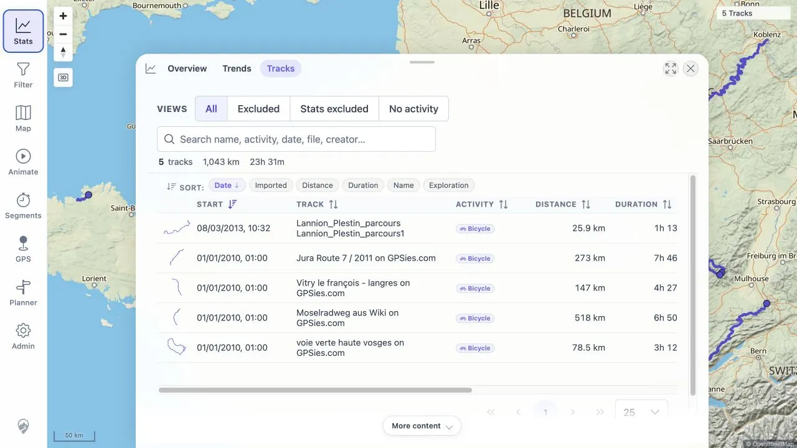

# Packet: IMP_08

## Scope

- Coverage source: [coverage-plan.md](../coverage-plan.md).
- Coverage ID or run packet: IMP_08.
- In scope: verify the statistics track count increased by five, unless a source split requires a documented mapping.
- Out of scope: aggregate-value and chart behavior covered by IMP_09.

## Prerequisites

- Required previous coverage IDs or run packets: IMP_07 and the empty IMP_01 baseline.
- Required app/data state: five successfully indexed public GPX files.
- Required browser context: signed-in desktop browser.

## Allowed Mutations

- Allowed: open Statistics > Tracks.
- Not allowed: change filters, edit, delete, or import tracks.

## Actions And Results

| Coverage ID | Action | Expected result | Actual result | Status | Evidence |
|---|---|---|---|---|---|
| IMP_08 | Compared the empty Statistics/Track Browser baseline with Statistics > Tracks after the five-file import; counted rows and checked the source-to-record mapping. | The count increases from 0 to 5 unless a legitimate source split is documented. | Statistics > Tracks shows 5 tracks and five rows. Each source produced exactly one record, so the count increased by exactly five and no split mapping was needed. | PASS | [assets/IMP_01-track-browser-baseline.webp](../assets/IMP_01-track-browser-baseline.webp); [assets/IMP_08-statistics-count.webp](../assets/IMP_08-statistics-count.webp); [assets/IMP_06-file-verification.txt](../assets/IMP_06-file-verification.txt) |

## Issues

| ID | Severity | Summary | Reproduction | Expected | Actual | Evidence | Release impact |
|---|---|---|---|---|---|---|---|

## Evidence Files

| File | Purpose |
|---|---|
| [assets/IMP_01-track-browser-baseline.webp](../assets/IMP_01-track-browser-baseline.webp) | Empty pre-import count. |
| [assets/IMP_08-statistics-count.webp](../assets/IMP_08-statistics-count.webp) | Post-import five-track Statistics table and summary. |
| [assets/IMP_06-file-verification.txt](../assets/IMP_06-file-verification.txt) | One-to-one source-to-record mapping. |

## Screenshot Evidence

## Timings

| Step | Timing |
|---|---:|
| Count and mapping check | 1 min |

## Handoff Notes

- Completed: exact 0-to-5 statistics count change and one-to-one source mapping.
- Remaining unfinished coverage: IMP_09 onward; DAT_03 still needs the FIT imported mapping.
- Blocked or not applicable: none.
- State left for the next packet: Statistics > Tracks is open with all five rows.
