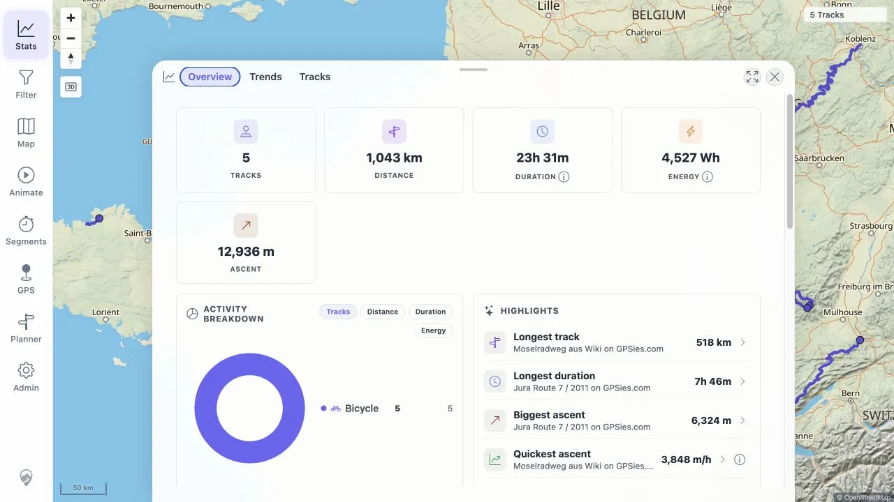
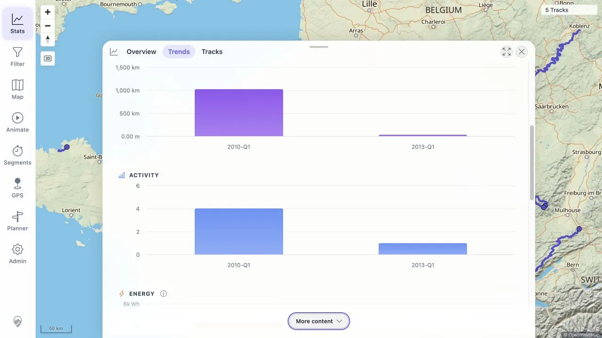
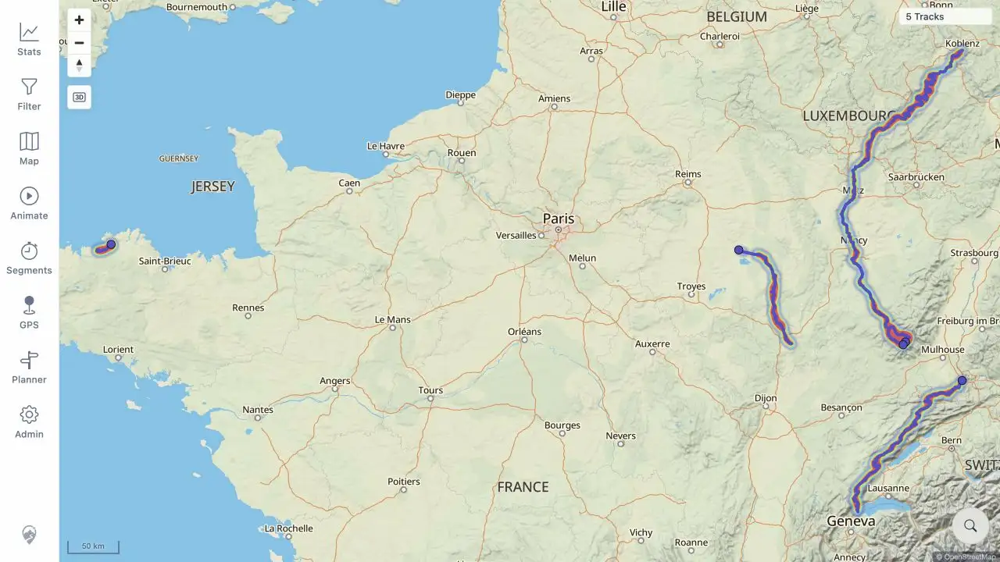

# Packet: IMP_09

## Scope

- Coverage source: [coverage-plan.md](../coverage-plan.md).
- Coverage ID or run packet: IMP_09.
- In scope: verify correct-direction changes for totals, ascent/descent, activity breakdown, period charts, rankings, heatmap density, and Track Browser summary.
- Out of scope: deletion synchronization, FIT import, and later detailed map/statistics coverage.

## Prerequisites

- Required previous coverage IDs or run packets: IMP_08 and the empty IMP_01 baseline.
- Required app/data state: synchronized five-track GPX state with no filter restrictions.
- Required browser context: signed-in desktop browser.

## Allowed Mutations

- Allowed: switch Statistics views, switch Trends table/charts, and temporarily enable the heatmap.
- Not allowed: edit, delete, or import tracks.

## Actions And Results

| Coverage ID | Action | Expected result | Actual result | Status | Evidence |
|---|---|---|---|---|---|
| IMP_09 | Compared the zero baseline with Statistics Overview, Trends table/charts, highlight rankings, heatmap, and Track Browser after import. | Every requested aggregate surface changes from empty/zero in the correct direction and stays internally consistent. | Statistics shows 5 tracks, 1,043 km, 23h 31m, 12,936 m ascent, positive per-track descent, 4,527 Wh, and Bicycle 5. Rankings are populated. Quarter table/charts split 4+1 tracks and retain the same totals. The heatmap follows imported route density. Track Browser repeats 5 tracks · 1,043 km · 23h 31m. | PASS | [assets/IMP_09-statistics-verification.txt](../assets/IMP_09-statistics-verification.txt); [assets/IMP_09-overview.webp](../assets/IMP_09-overview.webp); [assets/IMP_09-trends.webp](../assets/IMP_09-trends.webp); [assets/IMP_09-heatmap.webp](../assets/IMP_09-heatmap.webp); [assets/IMP_08-statistics-count.webp](../assets/IMP_08-statistics-count.webp) |

## Issues

| ID | Severity | Summary | Reproduction | Expected | Actual | Evidence | Release impact |
|---|---|---|---|---|---|---|---|

## Evidence Files

| File | Purpose |
|---|---|
| [assets/IMP_09-statistics-verification.txt](../assets/IMP_09-statistics-verification.txt) | Exact totals, rankings, period, heatmap, and browser-summary observations. |
| [assets/IMP_09-overview.webp](../assets/IMP_09-overview.webp) | Populated totals, activity breakdown, and rankings. |
| [assets/IMP_09-trends.webp](../assets/IMP_09-trends.webp) | Populated quarter period charts. |
| [assets/IMP_09-heatmap.webp](../assets/IMP_09-heatmap.webp) | Imported-route heatmap density. |
| [assets/IMP_08-statistics-count.webp](../assets/IMP_08-statistics-count.webp) | Track Browser summary and five records. |

## Screenshot Evidence

## Timings

| Step | Timing |
|---|---:|
| Overview and rankings | 2 min |
| Period table and charts | 2 min |
| Heatmap density and restore | 2 min |

## Handoff Notes

- Completed: all import aggregate, ranking, period, heatmap, and summary checks.
- Remaining unfinished coverage: DEL_01 onward; DAT_03 still needs the FIT imported mapping.
- Blocked or not applicable: none.
- State left for the next packet: five GPX files remain in the watched folder; heatmap is restored off; main map is open.
