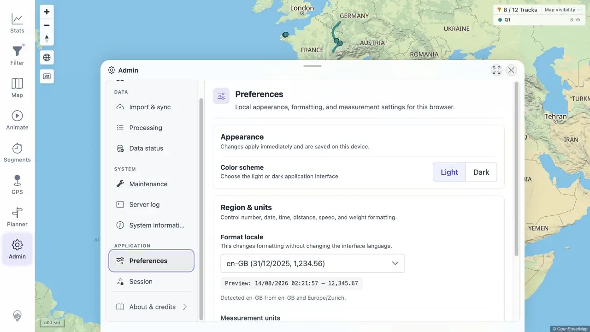

# Packet: LOC_01

## Scope

- Coverage source: [coverage-plan.md](../coverage-plan.md).
- Coverage ID or run packet: LOC_01.
- In scope: expected date, number, distance, duration, energy, ascent, and unit formatting.

## Prerequisites

- Required previous coverage IDs or run packets: APP_08.
- Required app/data state: populated Q1 Statistics.
- Required browser context: Admin Preferences and Statistics.

## Allowed Mutations

- Allowed: inspect formatting.
- Not allowed: change locale or units in this packet.

## Actions And Results

| Coverage ID | Action | Expected result | Actual result | Status | Evidence |
|---|---|---|---|---|---|
| LOC_01 | Recorded the detected locale previews and verified date, number, duration, and unit strings in populated Statistics. | Values render in the expected locale format. | en-GB/Europe-Zurich showed day/month dates, comma thousands, decimal dot, metric units, and concise durations consistently in preview and Statistics. | PASS | [preferences](../assets/LOC_01-preferences.webp), [values](../assets/LOC_01-formatting.txt) |

## Issues

No issue found.

## Evidence Files

| File | Purpose |
|---|---|
| [assets/LOC_01-preferences.webp](../assets/LOC_01-preferences.webp) | Locale/unit selection and preview. |
| [assets/LOC_01-formatting.txt](../assets/LOC_01-formatting.txt) | Preview and Statistics examples. |

## Screenshot Evidence

## Timings

| Step | Timing |
|---|---:|
| Preference/Statistics inspection | < 0.4 s each |

## Handoff Notes

- Completed: LOC_01 is terminal `PASS`.
- Remaining unfinished coverage: LOC_02 onward.
- Blocked or not applicable: none in this packet.
- State left for the next packet: light Statistics Overview with en-GB and default metric units.

