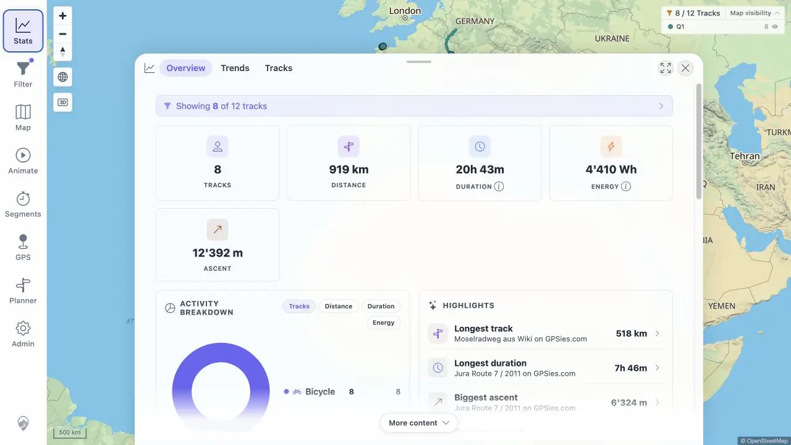

# Packet: LOC_02

## Scope

- Coverage source: [coverage-plan.md](../coverage-plan.md).
- Coverage ID or run packet: LOC_02.
- In scope: immediate cross-app formatting after locale change.

## Prerequisites

- Required previous coverage IDs or run packets: LOC_01.
- Required app/data state: en-GB preference and populated Statistics.
- Required browser context: Preferences and Statistics.

## Allowed Mutations

- Allowed: change locale to de-CH.
- Not allowed: reload browser.

## Actions And Results

| Coverage ID | Action | Expected result | Actual result | Status | Evidence |
|---|---|---|---|---|---|
| LOC_02 | Opened the eight-choice locale selector, changed en-GB to de-CH, checked preview, then opened Statistics without reload. | Formatting updates across the app without reload artifacts. | Preview, dates, energy, and ascent immediately used Swiss dots/apostrophes. No stale en-GB value remained on the tested Statistics surface. | PASS | [de-CH Statistics](../assets/LOC_02-deCH.webp), [before/after](../assets/LOC_02-change.txt) |

## Issues

No issue found.

## Evidence Files

| File | Purpose |
|---|---|
| [assets/LOC_02-deCH.webp](../assets/LOC_02-deCH.webp) | Populated Statistics after locale switch. |
| [assets/LOC_02-change.txt](../assets/LOC_02-change.txt) | Options and before/after values. |

## Screenshot Evidence

## Timings

| Step | Timing |
|---|---:|
| Locale application | < 0.2 s |
| Statistics render | < 0.3 s |

## Handoff Notes

- Completed: LOC_02 is terminal `PASS`.
- Remaining unfinished coverage: LOC_03 onward.
- Blocked or not applicable: none in this packet.
- State left for the next packet: de-CH Statistics Overview open.

