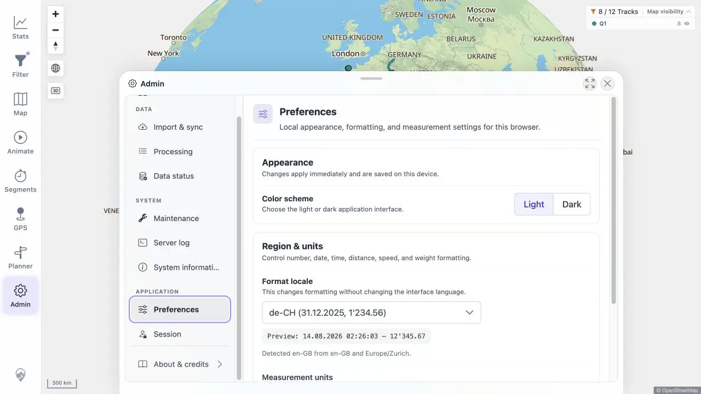

# Packet: LOC_03

## Scope

- Coverage source: [coverage-plan.md](../coverage-plan.md).
- Coverage ID or run packet: LOC_03.
- In scope: locale persistence across reload.

## Prerequisites

- Required previous coverage IDs or run packets: LOC_02.
- Required app/data state: de-CH selected and Statistics formatted.
- Required browser context: Statistics and Preferences.

## Allowed Mutations

- Allowed: reload browser; restore en-GB after evidence.
- Not allowed: select de-CH again after reload.

## Actions And Results

| Coverage ID | Action | Expected result | Actual result | Status | Evidence |
|---|---|---|---|---|---|
| LOC_03 | Reloaded de-CH Statistics, rechecked formatted values, and opened Preferences without re-selecting locale. | Locale persists across reload. | Swiss date/thousands formatting remained and the selector still read de-CH. | PASS | [persisted preference](../assets/LOC_03-persisted.webp), [values](../assets/LOC_03-persistence.txt) |

## Issues

No issue found.

## Evidence Files

| File | Purpose |
|---|---|
| [assets/LOC_03-persisted.webp](../assets/LOC_03-persisted.webp) | de-CH selector after reload. |
| [assets/LOC_03-persistence.txt](../assets/LOC_03-persistence.txt) | Persisted Statistics and selector values. |

## Screenshot Evidence

## Timings

| Step | Timing |
|---|---:|
| Reload to formatted Statistics | < 1.4 s |

## Handoff Notes

- Completed: LOC_03 is terminal `PASS`.
- Remaining unfinished coverage: LOC_04 onward.
- Blocked or not applicable: none in this packet.
- State left for the next packet: en-GB restored; light Admin Preferences open.

