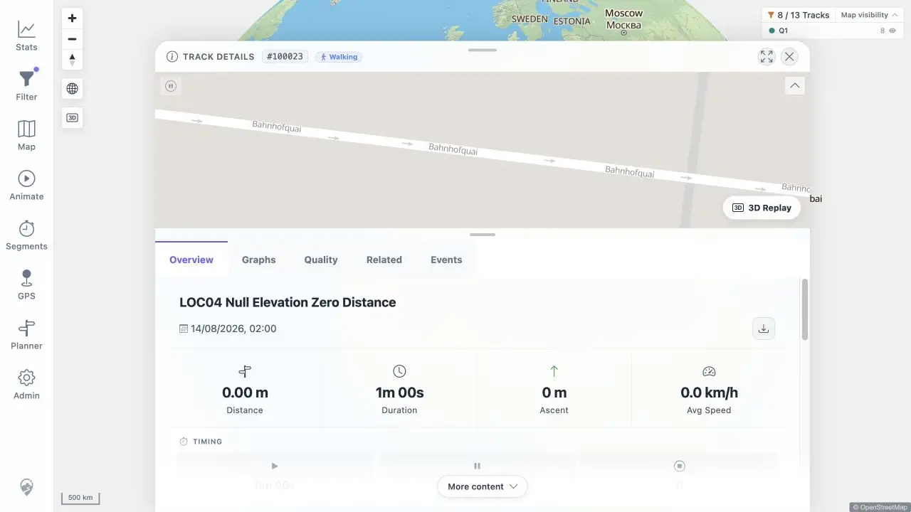

# Packet: LOC_04

## Scope

- Coverage source: [coverage-plan.md](../coverage-plan.md).
- Coverage ID or run packet: LOC_04.
- In scope: zero, very large, negative, and missing-elevation boundary formatting.

## Prerequisites

- Required previous coverage IDs or run packets: LOC_03.
- Required app/data state: Mosel/Lannion tracks plus one disposable no-elevation/zero-distance GPX.
- Required browser context: direct populated Track Details.

## Allowed Mutations

- Allowed: import and remove one fully synthetic boundary GPX.
- Not allowed: change existing tracks.

## Actions And Results

| Coverage ID | Action | Expected result | Actual result | Status | Evidence |
|---|---|---|---|---|---|
| LOC_04 | Opened a zero-distance/no-elevation synthetic track, the 518 km Mosel track, and a below-sea-level Lannion track; searched rendered copy for invalid tokens. | Boundary values render sensibly, not as NaN or blank. | Zero/missing metrics rendered explicit zero values and an actionable pending-energy message; large and negative values were formatted with units/signs. No NaN, undefined, literal null, or blank metric appeared. | PASS | [zero/null details](../assets/LOC_04-zero-null.webp), [values](../assets/LOC_04-boundaries.txt) |

## Issues

No issue found.

## Evidence Files

| File | Purpose |
|---|---|
| [assets/LOC_04-zero-null.webp](../assets/LOC_04-zero-null.webp) | Zero and missing-elevation Track Details. |
| [assets/LOC_04-boundaries.txt](../assets/LOC_04-boundaries.txt) | Zero, large, negative, and token checks. |

## Screenshot Evidence

## Timings

| Step | Timing |
|---|---:|
| Synthetic ingest | < 12 s |
| Track Details render | < 1 s each |

## Handoff Notes

- Completed: LOC_04 is terminal `PASS`.
- Remaining unfinished coverage: MOB_01 onward.
- Blocked or not applicable: none in this packet.
- State left for the next packet: en-GB; track #100004 details open; exact LOC_04 synthetic source removed and pending watcher cleanup.

