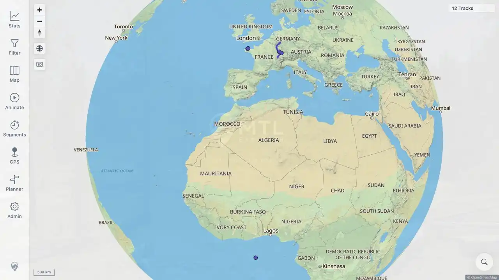

# Packet: MAP_01

## Scope

- Coverage source: [coverage-plan.md](../coverage-plan.md).
- Coverage ID or run packet: MAP_01.
- In scope: base map and track overlays on a fresh signed-in open.
- Out of scope: map interaction stress.

## Prerequisites

- Required previous coverage IDs or run packets: SGN_09.
- Required app/data state: 12 visible track records and healthy map status.
- Required browser context: signed-in desktop browser with sheets closed.

## Allowed Mutations

- Allowed: reload the app.
- Not allowed: change map configuration.

## Actions And Results

| Coverage ID | Action | Expected result | Actual result | Status | Evidence |
|---|---|---|---|---|---|
| MAP_01 | Reloaded the map, waited for startup to settle, inspected the rendered base map and overlays, and checked browser errors. | Base map and overlays load on first open. | The OpenStreetMap globe, labels, attribution, navigation controls, and colored track overlays rendered with the 12-track count. No browser error log entry was present. | PASS | [assets/MAP_01-first-open.webp](../assets/MAP_01-first-open.webp) |

## Issues

| ID | Severity | Summary | Reproduction | Expected | Actual | Evidence | Release impact |
|---|---|---|---|---|---|---|---|

## Evidence Files

| File | Purpose |
|---|---|
| [assets/MAP_01-first-open.webp](../assets/MAP_01-first-open.webp) | Freshly loaded base map and track overlays. |

## Screenshot Evidence

## Timings

| Step | Timing |
|---|---:|
| Reload to settled map | 1.9 s |

## Handoff Notes

- Completed: first-open map rendering.
- Remaining unfinished coverage: MAP_02 onward.
- Blocked or not applicable: none.
- State left for the next packet: fresh 12-track globe view with no sheet open.
