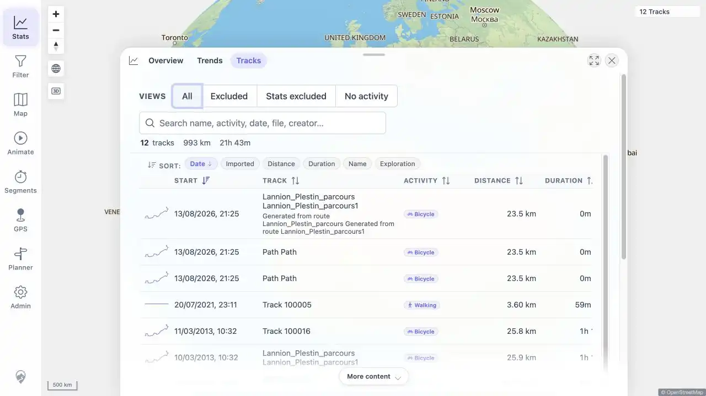

# Packet: MAP_02

## Scope

- Coverage source: [coverage-plan.md](../coverage-plan.md).
- Coverage ID or run packet: MAP_02.
- In scope: compare map visible count with the complete Track Browser view.
- Out of scope: duplicate-source diagnostics already recorded in FMT_01.

## Prerequisites

- Required previous coverage IDs or run packets: MAP_01 and FMT_01.
- Required app/data state: expected 12 visible records after smart duplicate suppression and the IGC split.
- Required browser context: signed-in desktop map.

## Allowed Mutations

- Allowed: open Statistics > Tracks > All.
- Not allowed: change filter or track inclusion.

## Actions And Results

| Coverage ID | Action | Expected result | Actual result | Status | Evidence |
|---|---|---|---|---|---|
| MAP_02 | Compared the map count to Statistics > Tracks > All and counted the rendered table rows. | All visible tracks appear and total/visible counts agree. | Map showed `12 Tracks`; Track Browser All showed 12 tracks and exactly 12 data rows. This matches the expected accepted-source mapping. | PASS | [assets/MAP_02-map-and-browser-count.webp](../assets/MAP_02-map-and-browser-count.webp); [assets/FMT_01-format-acceptance.txt](../assets/FMT_01-format-acceptance.txt) |

## Issues

| ID | Severity | Summary | Reproduction | Expected | Actual | Evidence | Release impact |
|---|---|---|---|---|---|---|---|

## Evidence Files

| File | Purpose |
|---|---|
| [assets/MAP_02-map-and-browser-count.webp](../assets/MAP_02-map-and-browser-count.webp) | Simultaneous 12-track map badge and 12-row All view. |
| [assets/FMT_01-format-acceptance.txt](../assets/FMT_01-format-acceptance.txt) | Expected visible-record mapping. |

## Screenshot Evidence

## Timings

| Step | Timing |
|---|---:|
| Count comparison | < 1 min |

## Handoff Notes

- Completed: map-visible and All-view count reconciliation.
- Remaining unfinished coverage: MAP_03 onward.
- Blocked or not applicable: none.
- State left for the next packet: Statistics > Tracks > All open with 12 rows.
