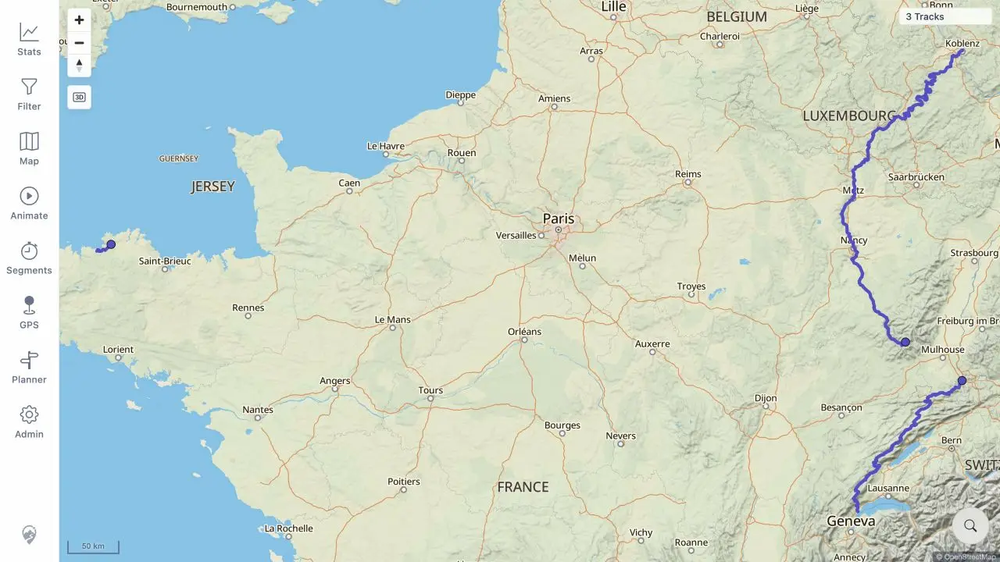
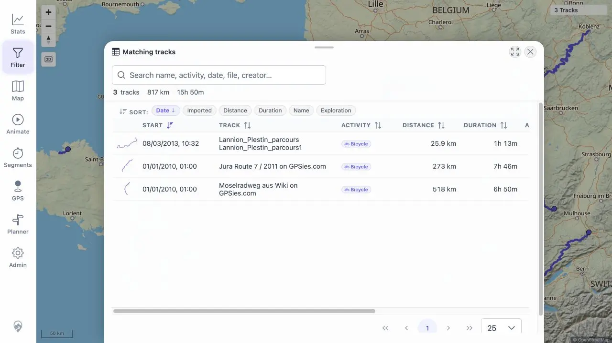

# Packet: MAP_04

## Scope

- Coverage source: [coverage-plan.md](../coverage-plan.md).
- Coverage ID or run packet: MAP_04.
- In scope: final user-visible map and selection state after the required deletion flow.
- Out of scope: stale URLs and deleted-track API probes.

## Prerequisites

- Required previous coverage IDs or run packets: DEL_01-DEL_05 and MAP_03.
- Required app/data state: preserved five→three deletion evidence from this run.
- Required browser context: recovered synchronized browser state used by DEL_05.

## Allowed Mutations

- Allowed: reuse the direct deletion-flow evidence packet.
- Not allowed: use an API result as a proxy for rendered map behavior.

## Actions And Results

| Coverage ID | Action | Expected result | Actual result | Status | Evidence |
|---|---|---|---|---|---|
| MAP_04 | Reviewed the post-delete map, former overlap selection, exact Track Browser searches, Filter, Related, heatmap, details entry points, and statistics. | Deleted tracks disappear from all map sources, selection lists, and popups. | After recovery from the separately recorded freshness-helper defect, neither deleted record or its geometry remained in any user-visible map/selection/popup entry point. | PASS | [assets/DEL_03-cross-surface.txt](../assets/DEL_03-cross-surface.txt); [assets/DEL_03-map.webp](../assets/DEL_03-map.webp); [assets/DEL_03-filter-recovered.webp](../assets/DEL_03-filter-recovered.webp); [assets/DEL_03-heatmap.webp](../assets/DEL_03-heatmap.webp) |

## Issues

| ID | Severity | Summary | Reproduction | Expected | Actual | Evidence | Release impact |
|---|---|---|---|---|---|---|---|

The earlier DEL-03-P1 freshness defect remains open; this packet records the final recovered map state only.

## Evidence Files

| File | Purpose |
|---|---|
| [assets/DEL_03-cross-surface.txt](../assets/DEL_03-cross-surface.txt) | User-visible surface and selection matrix. |
| [assets/DEL_03-map.webp](../assets/DEL_03-map.webp) | Map without the deleted lines. |
| [assets/DEL_03-filter-recovered.webp](../assets/DEL_03-filter-recovered.webp) | Recovered selection source without deleted rows. |
| [assets/DEL_03-heatmap.webp](../assets/DEL_03-heatmap.webp) | Heatmap without deleted paths. |

## Screenshot Evidence

## Timings

| Step | Timing |
|---|---:|
| Final user-visible deletion-state review | 1 min |

## Handoff Notes

- Completed: deleted map and selection data absent from final state.
- Remaining unfinished coverage: MAP_05 onward.
- Blocked or not applicable: none; DEL-03-P1 remains an open separate issue.
- State left for the next packet: current 12-track Statistics view remains open.
