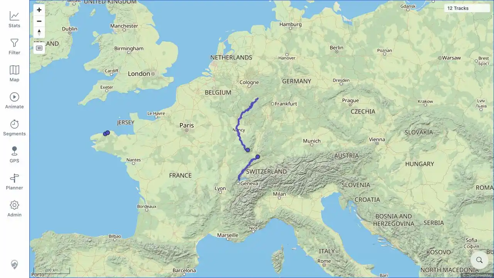
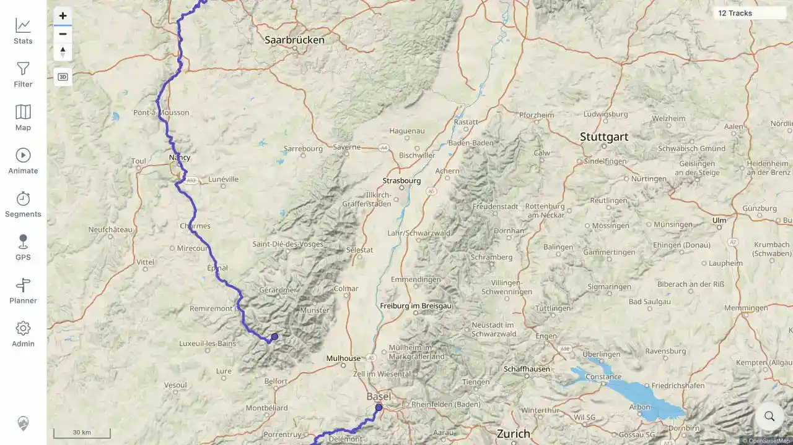

# Packet: MAP_05

## Scope

- Coverage source: [coverage-plan.md](../coverage-plan.md).
- Coverage ID or run packet: MAP_05.
- In scope: rendered track precision across map zoom levels.
- Out of scope: direction-arrow mode.

## Prerequisites

- Required previous coverage IDs or run packets: MAP_04.
- Required app/data state: Jura and Mosel public tracks rendered over Europe.
- Required browser context: signed-in desktop map.

## Allowed Mutations

- Allowed: pan, select, close details, and zoom the map.
- Not allowed: edit track data.

## Actions And Results

| Coverage ID | Action | Expected result | Actual result | Status | Evidence |
|---|---|---|---|---|---|
| MAP_05 | Centered the Mosel/Jura area, captured the regional 200 km-scale shape, then zoomed three levels to 30 km scale and inspected the line. | Detail/precision improves without duplicate or broken lines. | The regional line resolved into a continuous, more precise route through named towns at high zoom. No duplicate parallel copy, broken segment, or browser error appeared. | PASS | [assets/MAP_05-low-zoom.webp](../assets/MAP_05-low-zoom.webp); [assets/MAP_05-high-zoom.webp](../assets/MAP_05-high-zoom.webp) |

## Issues

| ID | Severity | Summary | Reproduction | Expected | Actual | Evidence | Release impact |
|---|---|---|---|---|---|---|---|

## Evidence Files

| File | Purpose |
|---|---|
| [assets/MAP_05-low-zoom.webp](../assets/MAP_05-low-zoom.webp) | Regional track geometry at 200 km scale. |
| [assets/MAP_05-high-zoom.webp](../assets/MAP_05-high-zoom.webp) | Detailed continuous track geometry at 30 km scale. |

## Screenshot Evidence

## Timings

| Step | Timing |
|---|---:|
| Center and zoom comparison | 2 min |

## Handoff Notes

- Completed: multi-level track precision check.
- Remaining unfinished coverage: MAP_06 onward.
- Blocked or not applicable: none.
- State left for the next packet: high-zoom 30 km Mosel-region map with sheets closed.
