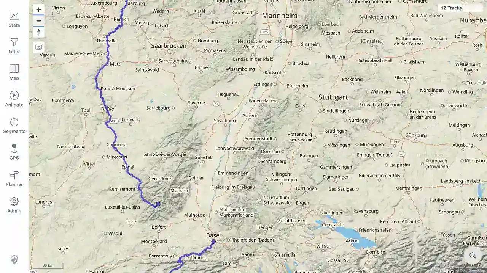

# Packet: MAP_06

## Scope

- Coverage source: [coverage-plan.md](../coverage-plan.md).
- Coverage ID or run packet: MAP_06.
- In scope: rapid map pan/zoom stability.
- Out of scope: formal performance profiling.

## Prerequisites

- Required previous coverage IDs or run packets: MAP_05.
- Required app/data state: public OSM base and rendered Mosel/Jura track overlays.
- Required browser context: signed-in desktop map at regional zoom.

## Allowed Mutations

- Allowed: repeated pan and zoom interactions.
- Not allowed: reload during the stress sequence.

## Actions And Results

| Coverage ID | Action | Expected result | Actual result | Status | Evidence |
|---|---|---|---|---|---|---|
| MAP_06 | Performed three rapid zoom changes and three long pans in alternating directions, waited 0.9 s, then returned to the track area. | No stale lines, missing tiles, or runaway loading spinner remains. | Tiles and labels fully settled; the continuous track overlay reappeared at 30 km scale; the 12-track badge remained; no loading text or browser error was present. | PASS | [assets/MAP_06-settled.webp](../assets/MAP_06-settled.webp) |

## Issues

| ID | Severity | Summary | Reproduction | Expected | Actual | Evidence | Release impact |
|---|---|---|---|---|---|---|---|

## Evidence Files

| File | Purpose |
|---|---|
| [assets/MAP_06-settled.webp](../assets/MAP_06-settled.webp) | Fully settled base tiles and continuous overlay after rapid interaction. |

## Screenshot Evidence

## Timings

| Step | Timing |
|---|---:|
| Stress sequence and initial settle | 2.16 s |
| Final area settle | 0.7 s |

## Handoff Notes

- Completed: map interaction stress check.
- Remaining unfinished coverage: MAP_07 onward.
- Blocked or not applicable: none.
- State left for the next packet: 30 km Mosel-region map with continuous track overlays.
