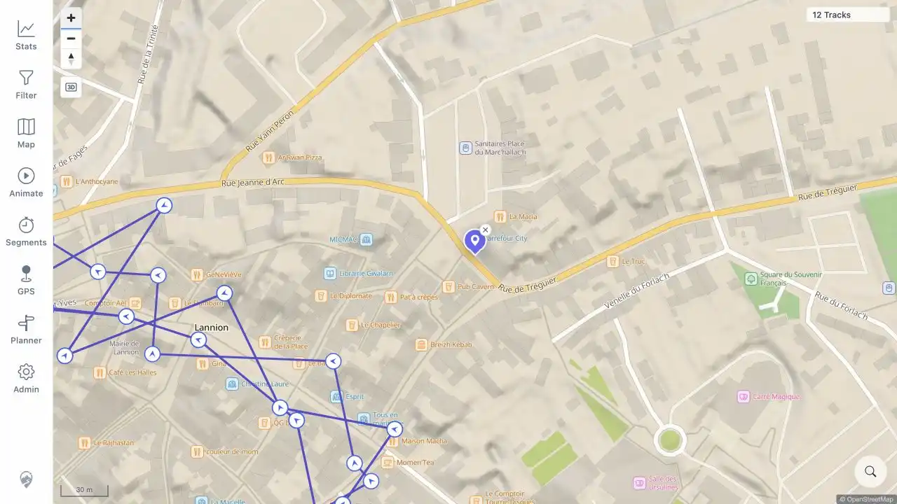

# Packet: MAP_07

## Scope

- Coverage source: [coverage-plan.md](../coverage-plan.md).
- Coverage ID or run packet: MAP_07.
- In scope: high-zoom direction arrows with Track points and direction enabled.
- Out of scope: marker popup content, covered by MAP_11.

## Prerequisites

- Required previous coverage IDs or run packets: MAP_06.
- Required app/data state: Track points and direction map layer enabled; dense public-derived Lannion tracks.
- Required browser context: signed-in desktop map.

## Allowed Mutations

- Allowed: confirm the map layer setting, location-search Lannion, and zoom to a dense in-viewport line.
- Not allowed: use an off-viewport two-point line as evidence.

## Actions And Results

| Coverage ID | Action | Expected result | Actual result | Status | Evidence |
|---|---|---|---|---|---|---|
| MAP_07 | Confirmed `Track points and direction` was enabled, searched Lannion, and zoomed from 100 m to 30 m scale over dense in-viewport vertices. | Direction arrows appear on the actual track at high zoom. | Numerous white circular point markers with blue directional arrowheads appeared at successive vertices along the visible Lannion line. | PASS | [assets/MAP_07-arrows.webp](../assets/MAP_07-arrows.webp) |

## Issues

| ID | Severity | Summary | Reproduction | Expected | Actual | Evidence | Release impact |
|---|---|---|---|---|---|---|---|

## Evidence Files

| File | Purpose |
|---|---|
| [assets/MAP_07-arrows.webp](../assets/MAP_07-arrows.webp) | High-zoom dense track with many in-viewport direction markers. |

## Screenshot Evidence

## Timings

| Step | Timing |
|---|---:|
| Layer verification and location positioning | 2 min |
| Final high-zoom render | < 1 s |

## Handoff Notes

- Completed: valid high-zoom direction-arrow evidence.
- Remaining unfinished coverage: MAP_08 onward.
- Blocked or not applicable: none.
- State left for the next packet: 30 m Lannion view with direction markers visible.
