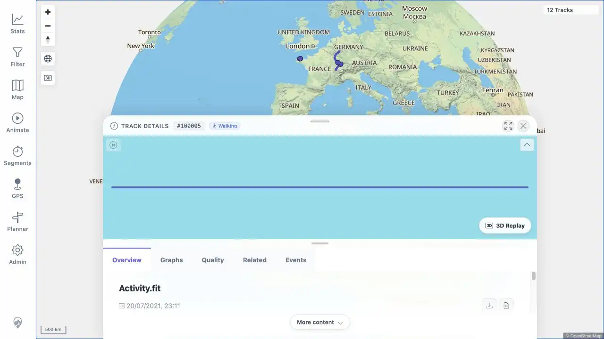

# Packet: MAP_08

## Scope

- Coverage source: [coverage-plan.md](../coverage-plan.md).
- Coverage ID or run packet: MAP_08.
- In scope: select an isolated single rendered track.
- Out of scope: overlap chooser behavior.

## Prerequisites

- Required previous coverage IDs or run packets: MAP_07 and FIT_02.
- Required app/data state: isolated Activity.fit geometry at the world view.
- Required browser context: signed-in desktop map.

## Allowed Mutations

- Allowed: reload to the fitted world view and click the isolated track.
- Not allowed: open it through Track Browser.

## Actions And Results

| Coverage ID | Action | Expected result | Actual result | Status | Evidence |
|---|---|---|---|---|---|---|
| MAP_08 | Clicked the isolated Activity.fit rendering at the world view. | The single track highlights and its details open directly. | No chooser appeared. The URL changed to `/mtl/track/100005`; Track Details `#100005`, Walking, Activity.fit, and its highlighted mini-map line opened. | PASS | [assets/MAP_08-single-track.webp](../assets/MAP_08-single-track.webp) |

## Issues

| ID | Severity | Summary | Reproduction | Expected | Actual | Evidence | Release impact |
|---|---|---|---|---|---|---|---|

## Evidence Files

| File | Purpose |
|---|---|
| [assets/MAP_08-single-track.webp](../assets/MAP_08-single-track.webp) | Directly opened single-track detail with highlighted mini-map line. |

## Screenshot Evidence

## Timings

| Step | Timing |
|---|---:|
| Click to opened details | < 1 s |

## Handoff Notes

- Completed: isolated single-track selection.
- Remaining unfinished coverage: MAP_09 onward.
- Blocked or not applicable: none.
- State left for the next packet: Activity.fit Track Details open over the world map.
