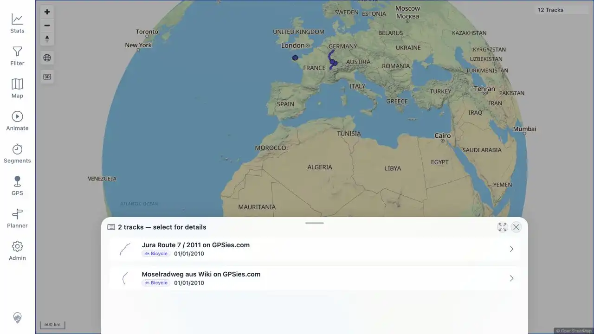
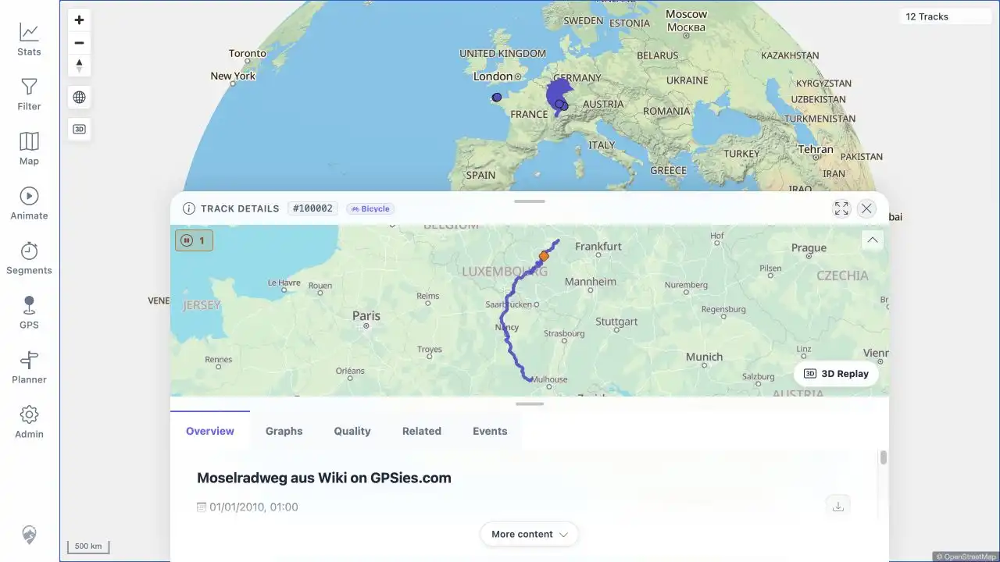

# Packet: MAP_09

## Scope

- Coverage source: [coverage-plan.md](../coverage-plan.md).
- Coverage ID or run packet: MAP_09.
- In scope: click overlapping track geometry, inspect the chooser, and pick a track.
- Out of scope: chooser dismissal.

## Prerequisites

- Required previous coverage IDs or run packets: MAP_08.
- Required app/data state: overlapping Jura and Mosel public tracks visible over Europe.
- Required browser context: signed-in fitted world map.

## Allowed Mutations

- Allowed: click the overlap and select Mosel from the chooser.
- Not allowed: use Track Browser as the entry point.

## Actions And Results

| Coverage ID | Action | Expected result | Actual result | Status | Evidence |
|---|---|---|---|---|---|---|
| MAP_09 | Clicked the European overlap and chose Moselradweg from the resulting list. | A multi-track selection list appears; choosing one opens its details. | A `2 tracks — select for details` chooser listed Jura and Mosel. Selecting Mosel opened `/mtl/track/100002` with matching title and details. | PASS | [assets/MAP_09-overlap-chooser.webp](../assets/MAP_09-overlap-chooser.webp); [assets/MAP_09-picked-details.webp](../assets/MAP_09-picked-details.webp) |

## Issues

| ID | Severity | Summary | Reproduction | Expected | Actual | Evidence | Release impact |
|---|---|---|---|---|---|---|---|

## Evidence Files

| File | Purpose |
|---|---|
| [assets/MAP_09-overlap-chooser.webp](../assets/MAP_09-overlap-chooser.webp) | Two-track overlap chooser. |
| [assets/MAP_09-picked-details.webp](../assets/MAP_09-picked-details.webp) | Matching Mosel detail after chooser selection. |

## Screenshot Evidence

## Timings

| Step | Timing |
|---|---:|
| Overlap click to chooser | < 1 s |
| Pick to matching details | < 1 s |

## Handoff Notes

- Completed: overlap chooser and selection.
- Remaining unfinished coverage: MAP_10 onward.
- Blocked or not applicable: none.
- State left for the next packet: Mosel #100002 Track Details open over the world map.
