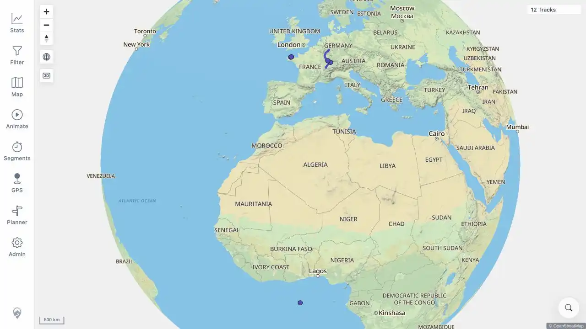

# Packet: MAP_10

## Scope

- Coverage source: [coverage-plan.md](../coverage-plan.md).
- Coverage ID or run packet: MAP_10.
- In scope: close the active track selection/detail state.
- Out of scope: opening another selection.

## Prerequisites

- Required previous coverage IDs or run packets: MAP_09.
- Required app/data state: Mosel Track Details open from the overlap chooser.
- Required browser context: signed-in desktop browser.

## Allowed Mutations

- Allowed: use the sheet Close control.
- Not allowed: reload the page to clear state.

## Actions And Results

| Coverage ID | Action | Expected result | Actual result | Status | Evidence |
|---|---|---|---|---|---|---|
| MAP_10 | Selected Close on the active Mosel Track Details sheet. | Selection clears and the map returns to normal. | The URL returned to `/mtl/`; Track Details and chooser were absent; the undimmed 12-track globe and all map controls were restored. | PASS | [assets/MAP_10-selection-closed.webp](../assets/MAP_10-selection-closed.webp) |

## Issues

| ID | Severity | Summary | Reproduction | Expected | Actual | Evidence | Release impact |
|---|---|---|---|---|---|---|---|

## Evidence Files

| File | Purpose |
|---|---|
| [assets/MAP_10-selection-closed.webp](../assets/MAP_10-selection-closed.webp) | Normal map state after clearing selection. |

## Screenshot Evidence

## Timings

| Step | Timing |
|---|---:|
| Close to normal map | < 1 s |

## Handoff Notes

- Completed: selection dismissal and normal-state restoration.
- Remaining unfinished coverage: MAP_11 onward.
- Blocked or not applicable: none.
- State left for the next packet: fitted 12-track world map with no sheet open.
