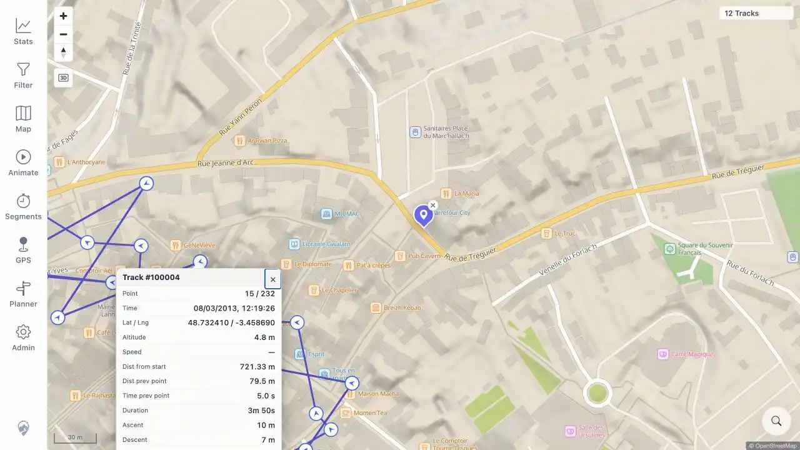

# Packet: MAP_11

## Scope

- Coverage source: [coverage-plan.md](../coverage-plan.md).
- Coverage ID or run packet: MAP_11.
- In scope: click an actual rendered direction/point marker and inspect its metrics.
- Out of scope: clicking only a connecting line.

## Prerequisites

- Required previous coverage IDs or run packets: MAP_10 and MAP_07.
- Required app/data state: direction markers enabled over dense Lannion public track vertices.
- Required browser context: signed-in desktop map at 30 m scale.

## Allowed Mutations

- Allowed: location-search Lannion, zoom, and click a white circular direction marker.
- Not allowed: use the connecting line as the click target.

## Actions And Results

| Coverage ID | Action | Expected result | Actual result | Status | Evidence |
|---|---|---|---|---|---|---|
| MAP_11 | Clicked the visible arrow marker that resolved to point 15 of track #100004. | A point popup shows the expected metrics. | The popup identified track/point and populated time, coordinates, altitude, distance from start, previous-point distance/time, elapsed duration, ascent/descent, and energy metrics. The source has no recorded point-speed extension, so Speed correctly displayed `—`. | PASS | [assets/MAP_11-point-popup.webp](../assets/MAP_11-point-popup.webp); [assets/IMP_07-map-detail-verification.txt](../assets/IMP_07-map-detail-verification.txt) |

## Issues

| ID | Severity | Summary | Reproduction | Expected | Actual | Evidence | Release impact |
|---|---|---|---|---|---|---|---|

## Evidence Files

| File | Purpose |
|---|---|
| [assets/MAP_11-point-popup.webp](../assets/MAP_11-point-popup.webp) | Actual high-zoom direction marker with its metrics popup. |
| [assets/IMP_07-map-detail-verification.txt](../assets/IMP_07-map-detail-verification.txt) | Earlier direct popup checks across all five public GPX tracks. |

## Screenshot Evidence

## Timings

| Step | Timing |
|---|---:|
| Position, marker selection, and popup check | 2 min |

## Handoff Notes

- Completed: actual rendered-marker popup metrics.
- Remaining unfinished coverage: MAP_12 onward.
- Blocked or not applicable: none.
- State left for the next packet: Lannion point popup open at 30 m scale.
