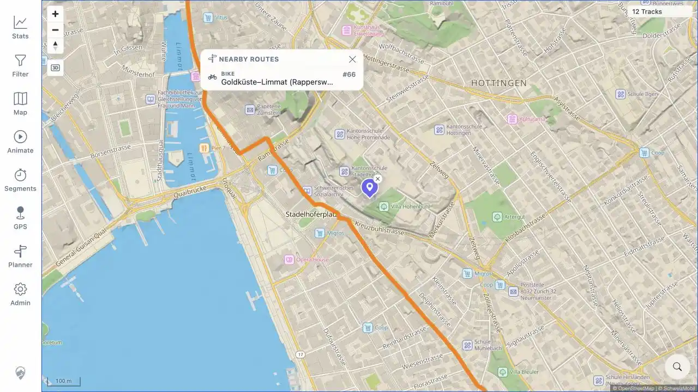
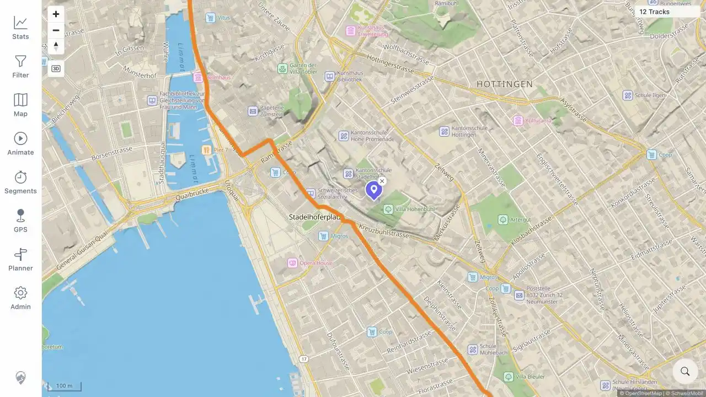

# Packet: MAP_12

## Scope

- Coverage source: [coverage-plan.md](../coverage-plan.md).
- Coverage ID or run packet: MAP_12.
- In scope: enable a Swiss Mobility overlay, select an official route, inspect and close its popup.
- Out of scope: worldwide Waymarked Trails overlays.

## Prerequisites

- Required previous coverage IDs or run packets: MAP_11.
- Required app/data state: Swiss cycling-route overlay available in map settings.
- Required browser context: signed-in desktop map with external route services reachable.

## Allowed Mutations

- Allowed: temporarily enable Swiss Cycling routes and location-search Zurich.
- Not allowed: leave the overlay enabled after the packet.

## Actions And Results

| Coverage ID | Action | Expected result | Actual result | Status | Evidence |
|---|---|---|---|---|---|---|
| MAP_12 | Enabled Swiss Cycling routes, searched Zurich, clicked an orange official route, then used Close nearby routes popup. | A nearby official-routes popup appears and closes cleanly. | The map rendered the SchweizMobil overlay/attribution. Clicking its line opened `Nearby Routes` with Bike route `Goldküste–Limmat (Rapperswil - Zürich)` #66. Close removed the popup without changing the map. The overlay was then disabled again. | PASS | [assets/MAP_12-nearby-route.webp](../assets/MAP_12-nearby-route.webp); [assets/MAP_12-popup-closed.webp](../assets/MAP_12-popup-closed.webp) |

## Issues

| ID | Severity | Summary | Reproduction | Expected | Actual | Evidence | Release impact |
|---|---|---|---|---|---|---|---|

## Evidence Files

| File | Purpose |
|---|---|
| [assets/MAP_12-nearby-route.webp](../assets/MAP_12-nearby-route.webp) | Official route popup with type, name, and number. |
| [assets/MAP_12-popup-closed.webp](../assets/MAP_12-popup-closed.webp) | Same map after clean popup dismissal. |

## Screenshot Evidence

## Timings

| Step | Timing |
|---|---:|
| Enable, position, identify route | 3 min |
| Popup close | < 1 s |

## Handoff Notes

- Completed: applicable Swiss Mobility popup and close path.
- Remaining unfinished coverage: MAP_13 onward.
- Blocked or not applicable: none.
- State left for the next packet: Swiss cycling overlay disabled; Zurich OSM map remains open.
