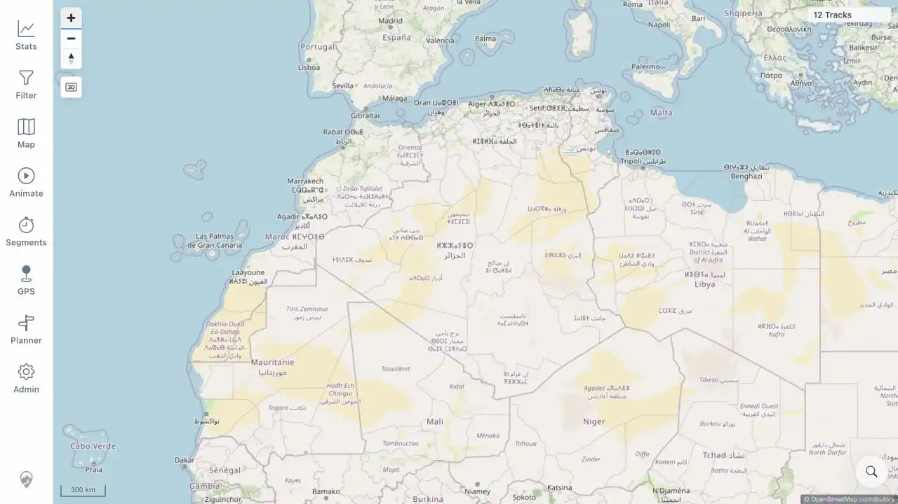
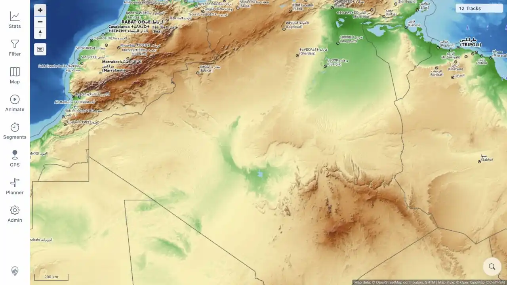
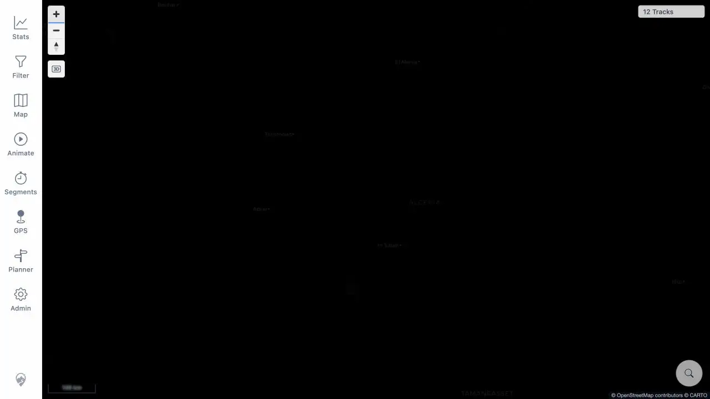

# Packet: MAP_13

## Scope

- Coverage source: [coverage-plan.md](../coverage-plan.md).
- Coverage ID or run packet: MAP_13.
- In scope: intentional remote-raster server mode, config shape, three OSM themes, attribution, interactivity, and map-proxy absence.
- Out of scope: local-vector fallback and manual source override.

## Prerequisites

- Required previous coverage IDs or run packets: MAP_12.
- Required app/data state: 12 visible tracks; original frozen run image cached.
- Required browser context: authenticated desktop browser.

## Allowed Mutations

- Allowed: temporary Compose override setting `MTL_MAP_SERVER_TILE_MODE=remote`, recreate only app, and restore the original cached run image after an upstream tag move.
- Not allowed: restart database or helper services, or continue evidence on a different image build.

## Actions And Results

| Coverage ID | Action | Expected result | Actual result | Status | Evidence |
|---|---|---|---|---|---|---|
| MAP_13 | Started only the app service in intentional remote mode on the frozen build; inspected authenticated config; selected OSM Light, OSM Topo Light, and OSM Dark; zoomed each; checked attribution/provider responses and app logs. | Config exposes light/light-topo/dark remote styles without legacy `remoteTileUrl`; each provider renders with matching attribution, stays interactive, and causes no map-proxy request. | Config returned `tileMode: remote`, all three exact provider URLs, and no legacy property. Each theme rendered, retained 12 tracks, changed scale on zoom, showed correct attribution, and its provider returned HTTP 200. App logs contained 0 map-proxy tile requests. | PASS | [assets/MAP_13-compose-override.yml](../assets/MAP_13-compose-override.yml); [assets/MAP_13-remote-mode-deployment.txt](../assets/MAP_13-remote-mode-deployment.txt); [assets/MAP_13-remote-raster-browser.txt](../assets/MAP_13-remote-raster-browser.txt); [assets/MAP_13-osm-light.webp](../assets/MAP_13-osm-light.webp); [assets/MAP_13-osm-topo.webp](../assets/MAP_13-osm-topo.webp); [assets/MAP_13-osm-dark.webp](../assets/MAP_13-osm-dark.webp) |

## Issues

| ID | Severity | Summary | Reproduction | Expected | Actual | Evidence | Release impact |
|---|---|---|---|---|---|---|---|

## Evidence Files

| File | Purpose |
|---|---|
| [assets/MAP_13-compose-override.yml](../assets/MAP_13-compose-override.yml) | Exact temporary remote-mode override. |
| [assets/MAP_13-remote-mode-deployment.txt](../assets/MAP_13-remote-mode-deployment.txt) | Effective config, image identity, and authenticated map config. |
| [assets/MAP_13-remote-raster-browser.txt](../assets/MAP_13-remote-raster-browser.txt) | Per-theme UI, provider, attribution, interactivity, and proxy matrix. |
| [assets/MAP_13-osm-light.webp](../assets/MAP_13-osm-light.webp) | OSM Light rendering. |
| [assets/MAP_13-osm-topo.webp](../assets/MAP_13-osm-topo.webp) | OSM Topo Light rendering. |
| [assets/MAP_13-osm-dark.webp](../assets/MAP_13-osm-dark.webp) | OSM Dark rendering. |

## Screenshot Evidence

## Timings

| Step | Timing |
|---|---:|
| Frozen-image remote-mode recreation and readiness | 29 s |
| Three-theme browser/provider pass | 1 min |

## Handoff Notes

- Completed: intentional remote-raster mode.
- Remaining unfinished coverage: MAP_14 onward.
- Blocked or not applicable: none.
- State left for the next packet: remote-mode override active on original build 1.331; OSM Dark selected; restore local mode before MAP_14.
