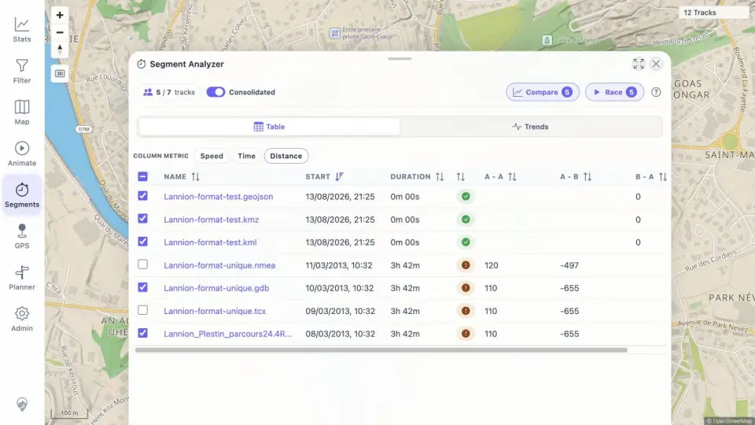

# Packet: MCT_01

## Scope

- Coverage source: [coverage-plan.md](../coverage-plan.md).
- Coverage ID or run packet: MCT_01.
- In scope: start the measure tool, select start/end zones, and inspect crossing-track metrics.
- Out of scope: result navigation and comparison behavior, covered next.

## Prerequisites

- Required previous coverage IDs or run packets: PLN_11.
- Required app/data state: twelve-track shared data set with overlapping Lannion tracks.
- Required browser context: signed-in desktop map centered on Lannion.

## Allowed Mutations

- Allowed: open Segment Analyzer and place two temporary zones.
- Not allowed: change stored tracks or filter state.

## Actions And Results

| Coverage ID | Action | Expected result | Actual result | Status | Evidence |
|---|---|---|---|---|---|
| MCT_01 | Opened Segments, placed zones A and B across the overlapping Lannion tracks, ran Analyze, and switched among Speed, Time, and Distance. | A result list of crossing tracks appears with speed, time, and distance. | Zone badges reported 8, 7, and 7 shared tracks; analysis opened a populated result table with all three metric controls and measured timed-track values. | PASS | [results](../assets/MCT_01-results.webp), [observations](../assets/MCT_01-results.txt) |

## Issues

No issue found.

## Evidence Files

| File | Purpose |
|---|---|
| [assets/MCT_01-results.webp](../assets/MCT_01-results.webp) | Compact Segment Analyzer result table. |
| [assets/MCT_01-results.txt](../assets/MCT_01-results.txt) | Exact zone counts and sample metric values. |

## Screenshot Evidence

## Timings

| Step | Timing |
|---|---:|
| Zone feedback | < 1 s each |
| Analyze results | 1.2 s |

## Handoff Notes

- Completed: MCT_01 is terminal `PASS`.
- Remaining unfinished coverage: MCT_02 onward.
- Blocked or not applicable: none in this packet.
- State left for the next packet: Segment Analyzer result table open with five consolidated Lannion results.
