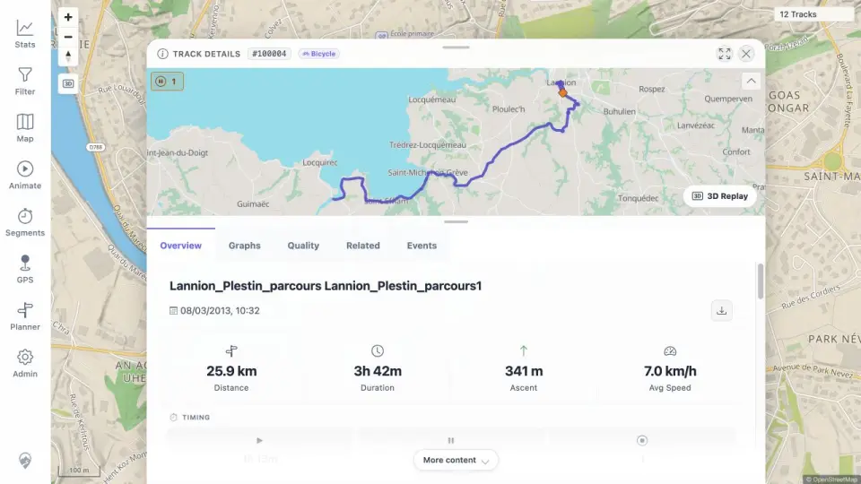

# Packet: MCT_02

## Scope

- Coverage source: [coverage-plan.md](../coverage-plan.md).
- Coverage ID or run packet: MCT_02.
- In scope: measured-result navigation.
- Out of scope: analyzer cleanup and multi-track comparison.

## Prerequisites

- Required previous coverage IDs or run packets: MCT_01.
- Required app/data state: populated Segment Analyzer result table.
- Required browser context: signed-in desktop map.

## Allowed Mutations

- Allowed: click one measured result and inspect the resulting detail surface.
- Not allowed: change track metadata or stored data.

## Actions And Results

| Coverage ID | Action | Expected result | Actual result | Status | Evidence |
|---|---|---|---|---|---|
| MCT_02 | Clicked `Lannion_Plestin_parcours24.4RE.gpx` in the measured result table. | Clicking a result opens its track details or segment view. | The app opened Track Details at `/track/100004` with matching source identity and populated overview metrics; the analyzer remained available underneath. | PASS | [details](../assets/MCT_02-details.webp), [identity](../assets/MCT_02-details.txt) |

## Issues

No issue found.

## Evidence Files

| File | Purpose |
|---|---|
| [assets/MCT_02-details.webp](../assets/MCT_02-details.webp) | Matching details opened from the measurement row. |
| [assets/MCT_02-details.txt](../assets/MCT_02-details.txt) | Exact URL and visible track identity. |

## Screenshot Evidence

## Timings

| Step | Timing |
|---|---:|
| Result to details | 1.0 s |

## Handoff Notes

- Completed: MCT_02 is terminal `PASS`.
- Remaining unfinished coverage: MCT_03 onward.
- Blocked or not applicable: none in this packet.
- State left for the next packet: Track Details #100004 open over the populated analyzer result sheet.
