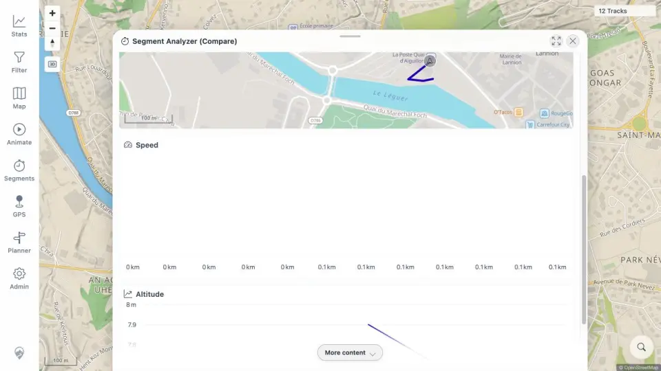

# Packet: MCT_04

## Scope

- Coverage source: [coverage-plan.md](../coverage-plan.md).
- Coverage ID or run packet: MCT_04.
- In scope: multi-track segment chart and map behavior with incomplete selections.
- Out of scope: extraction bounds, covered next.

## Prerequisites

- Required previous coverage IDs or run packets: MCT_03.
- Required app/data state: five selected analyzer results, including three zero-duration format variants.
- Required browser context: populated Segment Analyzer result sheet.

## Allowed Mutations

- Allowed: open Compare and inspect map, cards, and charts.
- Not allowed: mutate track records.

## Actions And Results

| Coverage ID | Action | Expected result | Actual result | Status | Evidence |
|---|---|---|---|---|---|
| MCT_04 | Opened Compare with five selected tracks and inspected the A-A segment cards, local map, Speed chart, and Altitude chart. | Several tracks align in a comparison chart and map even with missing data. | The UI explicitly skipped three tracks without the segment, aligned the two valid tracks on the local map, and rendered two-line Speed and Altitude charts. | PASS | [comparison](../assets/MCT_04-compare.webp), [observations](../assets/MCT_04-compare.txt) |

## Issues

No issue found.

## Evidence Files

| File | Purpose |
|---|---|
| [assets/MCT_04-compare.webp](../assets/MCT_04-compare.webp) | Local segment map and aligned comparison charts. |
| [assets/MCT_04-compare.txt](../assets/MCT_04-compare.txt) | Selection, skip message, card values, and chart summaries. |

## Screenshot Evidence

## Timings

| Step | Timing |
|---|---:|
| Compare open | 1.0 s |
| Chart/map settle | < 1 s |

## Handoff Notes

- Completed: MCT_04 is terminal `PASS`.
- Remaining unfinished coverage: MCT_05 onward.
- Blocked or not applicable: none in this packet.
- State left for the next packet: Compare overlay open on A-A with two comparable tracks and three explicit skips.
