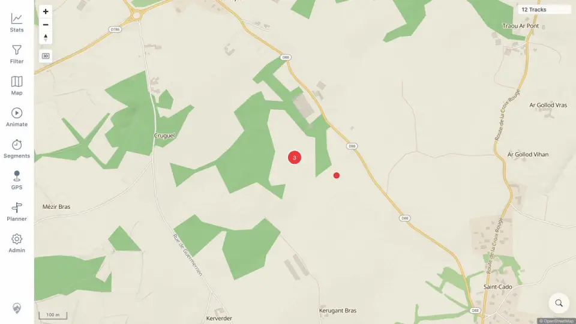

# Packet: MED_01

## Scope

- Coverage source: [coverage-plan.md](../coverage-plan.md).
- Coverage ID or run packet: MED_01.
- In scope: photo/media layer toggle and visible pins.
- Out of scope: viewport loading, previews, HEIC, and broken content.

## Prerequisites

- Required previous coverage IDs or run packets: AVR_04.
- Required app/data state: four synthetic geotagged media files indexed by Admin Rescan Media.
- Required browser context: desktop map with media layer initially off.

## Allowed Mutations

- Allowed: add disposable synthetic media, rescan, toggle media, and hide track-point arrows for clarity.
- Not allowed: use private photos or derive assets from private data.

## Actions And Results

| Coverage ID | Action | Expected result | Actual result | Status | Evidence |
|---|---|---|---|---|---|
| MED_01 | Enabled Photos and media in Map > Your data, moved to the indexed coordinates, and inspected the media layer. | Photo pins appear when the media layer is enabled. | Layer count changed 2/4→3/4 and a cluster of three plus one single red media pin rendered at 100 m scale. | PASS | [pins](../assets/MED_01-pins.webp), [indexed data](../assets/MED_01-pins.txt) |

## Issues

No issue found.

## Evidence Files

| File | Purpose |
|---|---|
| [assets/MED_01-pins.webp](../assets/MED_01-pins.webp) | Clustered and individual media pins. |
| [assets/MED_01-pins.txt](../assets/MED_01-pins.txt) | Synthetic file identities, coordinates, and toggle result. |

## Screenshot Evidence

## Timings

| Step | Timing |
|---|---:|
| Media rescan/index | < 3 s |
| Initial in-bounds render | < 1 s after movement |

## Handoff Notes

- Completed: MED_01 is terminal `PASS`.
- Remaining unfinished coverage: MED_02 onward.
- Blocked or not applicable: none in this packet.
- State left for the next packet: media enabled, track-point arrows hidden, view centered on one three-photo cluster and one single pin.
