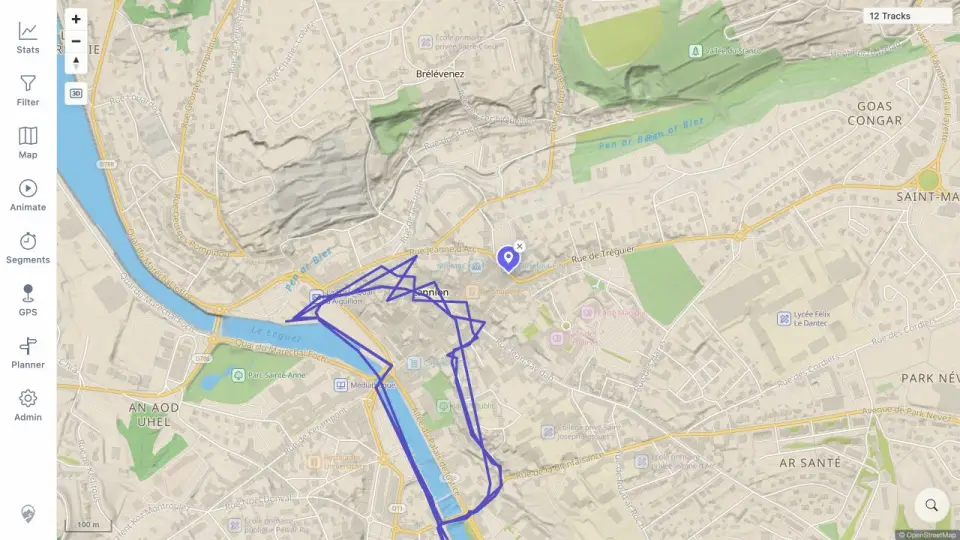
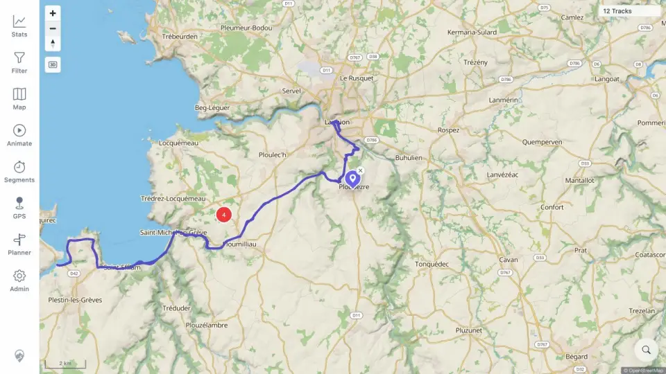

# Packet: MED_02

## Scope

- Coverage source: [coverage-plan.md](../coverage-plan.md).
- Coverage ID or run packet: MED_02.
- In scope: viewport-dependent media loading during map movement.
- Out of scope: preview content and conversion.

## Prerequisites

- Required previous coverage IDs or run packets: MED_01.
- Required app/data state: four indexed synthetic media points; media enabled.
- Required browser context: desktop map.

## Allowed Mutations

- Allowed: search locations and zoom the map.
- Not allowed: toggle media off or change indexed records.

## Actions And Results

| Coverage ID | Action | Expected result | Actual result | Status | Evidence |
|---|---|---|---|---|---|
| MED_02 | Moved from the media area to unrelated central Lannion, then moved/zoomed until the media bounds entered view. | Media loads for current viewport, not as a whole-world set. | Central Lannion showed no media; the wider southwest viewport loaded one cluster of four, which expanded to a three-item cluster plus one pin. | PASS | [empty viewport](../assets/MED_02-empty-viewport.webp), [populated viewport](../assets/MED_02-populated-viewport.webp), [sequence](../assets/MED_02-bounds.txt) |

## Issues

No issue found.

## Evidence Files

| File | Purpose |
|---|---|
| [assets/MED_02-empty-viewport.webp](../assets/MED_02-empty-viewport.webp) | No media pins outside indexed bounds. |
| [assets/MED_02-populated-viewport.webp](../assets/MED_02-populated-viewport.webp) | Four-item cluster loaded after bounds movement. |
| [assets/MED_02-bounds.txt](../assets/MED_02-bounds.txt) | Exact movement and cluster transitions. |

## Screenshot Evidence

## Timings

| Step | Timing |
|---|---:|
| Bounds reload after movement | < 1 s |

## Handoff Notes

- Completed: MED_02 is terminal `PASS`.
- Remaining unfinished coverage: MED_03 onward.
- Blocked or not applicable: none in this packet.
- State left for the next packet: 2 km view with one four-item cluster visible.
