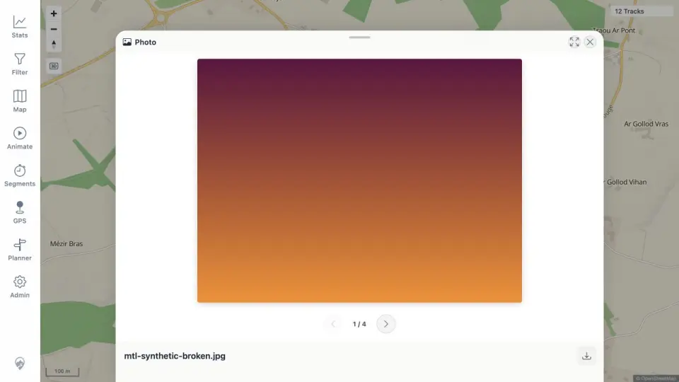

# Packet: MED_03

## Scope

- Coverage source: [coverage-plan.md](../coverage-plan.md).
- Coverage ID or run packet: MED_03.
- In scope: media-pin preview and next/previous navigation.
- Out of scope: HEIC conversion and broken-file recovery.

## Prerequisites

- Required previous coverage IDs or run packets: MED_02.
- Required app/data state: four media points visible as cluster plus pin.
- Required browser context: desktop map at 100 m scale.

## Allowed Mutations

- Allowed: click one pin and navigate preview items.
- Not allowed: remove or change files.

## Actions And Results

| Coverage ID | Action | Expected result | Actual result | Status | Evidence |
|---|---|---|---|---|---|
| MED_03 | Clicked the individual pin, then used Next and Previous. | Photo preview opens and next/previous navigation works. | Preview rendered item 1/4; Next opened `mtl-synthetic-b.jpg` at 2/4 and Previous returned to the first rendered image. | PASS | [preview](../assets/MED_03-preview.webp), [navigation](../assets/MED_03-navigation.txt) |

## Issues

No issue found.

## Evidence Files

| File | Purpose |
|---|---|
| [assets/MED_03-preview.webp](../assets/MED_03-preview.webp) | Rendered photo sheet with navigation and filename. |
| [assets/MED_03-navigation.txt](../assets/MED_03-navigation.txt) | Exact item transitions and control state. |

## Screenshot Evidence

## Timings

| Step | Timing |
|---|---:|
| Preview open | 0.8 s |
| Each navigation | 0.5 s |

## Handoff Notes

- Completed: MED_03 is terminal `PASS`.
- Remaining unfinished coverage: MED_04 onward.
- Blocked or not applicable: none in this packet.
- State left for the next packet: preview open at item 1/4; HEIC is available through navigation.
