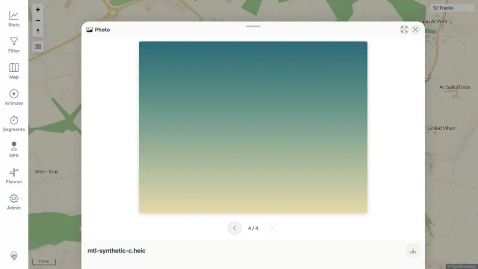

# Packet: MED_04

## Scope

- Coverage source: [coverage-plan.md](../coverage-plan.md).
- Coverage ID or run packet: MED_04.
- In scope: indexed HEIC rendering through server conversion.
- Out of scope: missing source behavior.

## Prerequisites

- Required previous coverage IDs or run packets: MED_03.
- Required app/data state: geotagged synthetic HEIC indexed as media 400003.
- Required browser context: four-item photo preview.

## Allowed Mutations

- Allowed: navigate to HEIC and make a read-only content request.
- Not allowed: convert the displayed asset client-side.

## Actions And Results

| Coverage ID | Action | Expected result | Actual result | Status | Evidence |
|---|---|---|---|---|---|
| MED_04 | Navigated to `mtl-synthetic-c.heic`, inspected the rendered preview, and verified the content response. | HEIC displays correctly after server-side conversion. | The 4/4 HEIC gradient rendered normally; the endpoint returned HTTP 200 `image/jpeg`, a valid 640×480 12,508-byte JPEG. | PASS | [preview](../assets/MED_04-heic.webp), [conversion](../assets/MED_04-heic.txt) |

## Issues

No issue found.

## Evidence Files

| File | Purpose |
|---|---|
| [assets/MED_04-heic.webp](../assets/MED_04-heic.webp) | Rendered HEIC item in the photo sheet. |
| [assets/MED_04-heic.txt](../assets/MED_04-heic.txt) | Source format and server JPEG response details. |

## Screenshot Evidence

## Timings

| Step | Timing |
|---|---:|
| HEIC navigation/render | 0.5 s |
| Direct conversion response | 0.3 s |

## Handoff Notes

- Completed: MED_04 is terminal `PASS`.
- Remaining unfinished coverage: MED_05 onward.
- Blocked or not applicable: none in this packet.
- State left for the next packet: photo preview on HEIC item 4/4; synthetic broken-file source still present and ready to remove.
