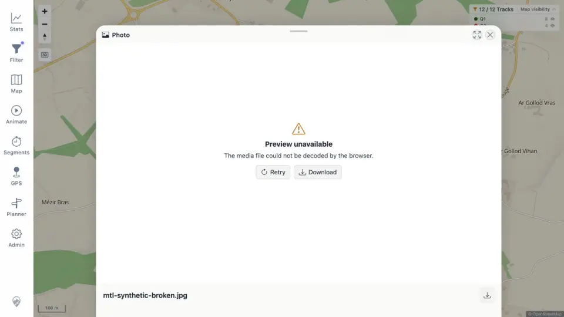
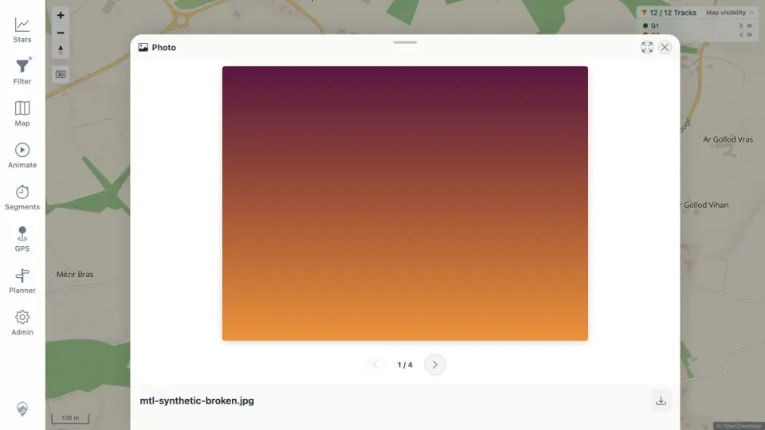

# Packet: MED_05

## Scope

- Coverage source: [coverage-plan.md](../coverage-plan.md).
- Coverage ID or run packet: MED_05.
- In scope: recoverable missing media source behavior.
- Out of scope: permanent deletion/index removal.

## Prerequisites

- Required previous coverage IDs or run packets: MED_04.
- Required app/data state: indexed synthetic JPEG with a recoverable local backup.
- Required browser context: uncached app origin to avoid a stale image response.

## Allowed Mutations

- Allowed: temporarily remove and restore the exact disposable synthetic source.
- Not allowed: delete private/user media or leave the source missing.

## Actions And Results

| Coverage ID | Action | Expected result | Actual result | Status | Evidence |
|---|---|---|---|---|---|
| MED_05 | Removed the indexed synthetic source, opened its pin in an uncached origin, restored the file, and clicked Retry. | Missing/broken photo shows a recoverable error rather than a blank sheet. | A complete `Preview unavailable` sheet offered Retry and Download; after exact restoration, Retry rendered item 1/4 normally. | PASS | [error](../assets/MED_05-missing.webp), [recovered](../assets/MED_05-recovered.webp), [sequence](../assets/MED_05-recovery.txt) |

## Issues

No issue found.

## Evidence Files

| File | Purpose |
|---|---|
| [assets/MED_05-missing.webp](../assets/MED_05-missing.webp) | Actionable error surface for missing content. |
| [assets/MED_05-recovered.webp](../assets/MED_05-recovered.webp) | Successful Retry after source restoration. |
| [assets/MED_05-recovery.txt](../assets/MED_05-recovery.txt) | Exact remove/restore/retry sequence. |

## Screenshot Evidence

## Timings

| Step | Timing |
|---|---:|
| Missing preview error | 0.8 s |
| Retry after restore | 0.7 s |

## Handoff Notes

- Completed: MED_05 is terminal `PASS`.
- Remaining unfinished coverage: HMO_01 onward.
- Blocked or not applicable: none in this packet.
- State left for the next packet: synthetic source restored; Photo preview open in IP-origin context; filter remains Q1 from that origin.
