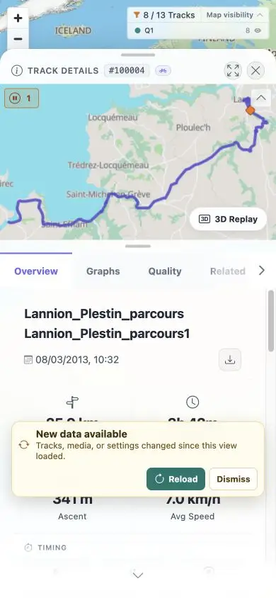

# Packet: MOB_01

## Scope

- Coverage source: [coverage-plan.md](../coverage-plan.md).
- Coverage ID or run packet: MOB_01.
- In scope: narrow mobile width and touch-enabled input mode.

## Prerequisites

- Required previous coverage IDs or run packets: LOC_04.
- Required app/data state: populated Track Details.
- Required browser context: 390 x 844 viewport and browser capabilities.

## Allowed Mutations

- Allowed: set a mobile viewport and inspect capabilities.
- Not allowed: infer touch success from mouse/pointer events.

## Actions And Results

| Coverage ID | Action | Expected result | Actual result | Status | Evidence |
|---|---|---|---|---|---|
| MOB_01 | Set 390 x 844, verified the mobile UI, and inspected the browser's advertised input capabilities. | Test narrow width with touch input enabled. | Narrow mobile rendering worked, but the browser exposes no touch-event/emulation capability; real touch input could not be enabled or attributed. | BLOCKED | [mobile UI](../assets/MOB_01-mobile.webp), [capability](../assets/MOB_01-capability.txt) |

## Issues

No product issue created; this is a browser-harness constraint.

## Evidence Files

| File | Purpose |
|---|---|
| [assets/MOB_01-mobile.webp](../assets/MOB_01-mobile.webp) | 390 x 844 Track Details. |
| [assets/MOB_01-capability.txt](../assets/MOB_01-capability.txt) | Missing touch capability and unblock path. |

## Screenshot Evidence

## Timings

| Step | Timing |
|---|---:|
| Responsive reflow | < 0.3 s |

## Handoff Notes

- Completed: MOB_01 is terminal `BLOCKED`.
- Remaining unfinished coverage: MOB_02 onward.
- Blocked or not applicable: touch-enabled part blocked; narrow responsive part executed.
- State left for the next packet: 390 x 844 Track Details with freshness banner visible.

