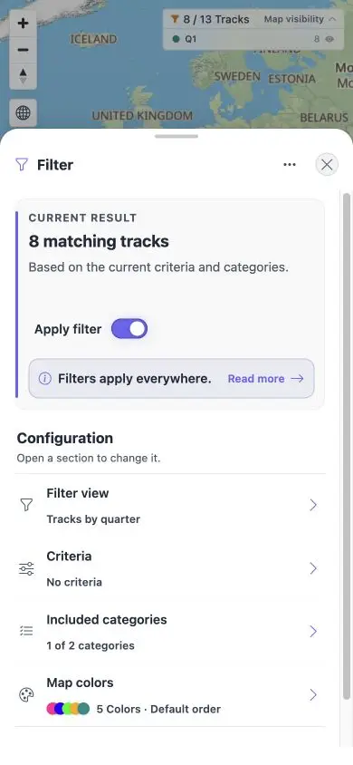
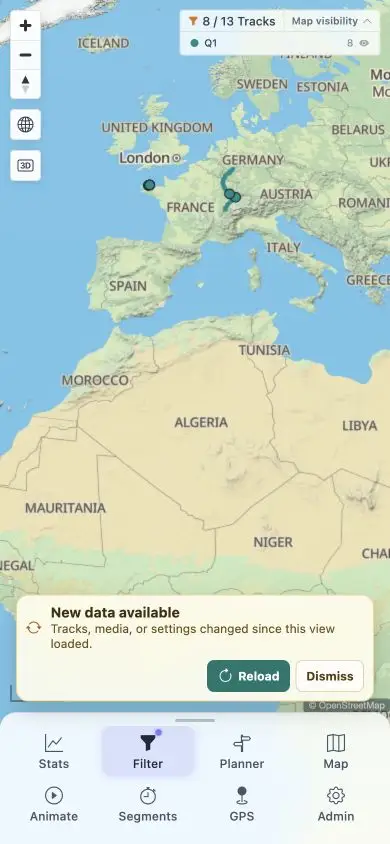

# Packet: MOB_02

## Scope

- Coverage source: [coverage-plan.md](../coverage-plan.md).
- Coverage ID or run packet: MOB_02.
- In scope: bottom-sheet and navigation-sheet drag, snap, and close.

## Prerequisites

- Required previous coverage IDs or run packets: MOB_01.
- Required app/data state: mobile Track Details, Filter, and navigation sheet.
- Required browser context: 390 x 844 pointer-only browser.

## Allowed Mutations

- Allowed: pointer drag/click exact sheet handles and close buttons.
- Not allowed: claim touch behavior from pointer events.

## Actions And Results

| Coverage ID | Action | Expected result | Actual result | Status | Evidence |
|---|---|---|---|---|---|
| MOB_02 | Exercised Track Details/Filter close, dragged the exact Filter handle, and repeatedly dragged the exact navigation handle/halo. | Bottom sheets and navigation sheet drag, snap, and close correctly. | Filter moved and settled at a second position; Track Details and Filter closed. Navigation stayed fixed under pointer drags. With no touch capability, its touch drag path could not be executed or attributed. | BLOCKED | [Filter snap](../assets/MOB_02-filter-snapped.webp), [navigation](../assets/MOB_02-nav.webp), [measurements](../assets/MOB_02-sheets.txt) |

## Issues

No product issue created because the missing touch harness prevents attribution.

## Evidence Files

| File | Purpose |
|---|---|
| [assets/MOB_02-filter-snapped.webp](../assets/MOB_02-filter-snapped.webp) | Filter at the second settled position. |
| [assets/MOB_02-nav.webp](../assets/MOB_02-nav.webp) | Navigation sheet in the pointer-only harness. |
| [assets/MOB_02-sheets.txt](../assets/MOB_02-sheets.txt) | Bounds, drag, close, and constraint details. |

## Screenshot Evidence

## Timings

| Step | Timing |
|---|---:|
| Sheet settle after drag | < 0.3 s |
| Sheet close | < 0.6 s |

## Handoff Notes

- Completed: MOB_02 is terminal `BLOCKED`.
- Remaining unfinished coverage: MOB_03 onward.
- Blocked or not applicable: navigation touch drag/snap needs a touch-capable harness.
- State left for the next packet: 390 x 844 map; Filter sheet hidden; URL remains `/mtl/filter`.

