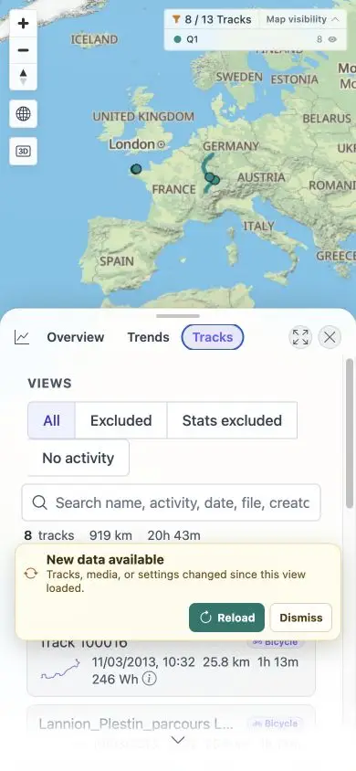

# Packet: MOB_03

## Scope

- Coverage source: [coverage-plan.md](../coverage-plan.md).
- Coverage ID or run packet: MOB_03.
- In scope: mobile tables/cards, charts, map controls, and overflow.

## Prerequisites

- Required previous coverage IDs or run packets: MOB_02.
- Required app/data state: populated Q1 Statistics.
- Required browser context: 390 x 844 viewport.

## Allowed Mutations

- Allowed: open/close Statistics tabs and inspect bounds.
- Not allowed: modify data.

## Actions And Results

| Coverage ID | Action | Expected result | Actual result | Status | Evidence |
|---|---|---|---|---|---|
| MOB_03 | Audited Statistics charts and Tracks cards for bounds/overflow, then closed Statistics and inspected all map controls. | Tables, charts, and controls stay usable; no text overflows. | Charts and mobile cards fit the 390 px document, no element crossed viewport bounds, long text used intentional ellipsis, and all five map controls stayed on-screen. | PASS | [Statistics](../assets/MOB_03-stats.webp), [Tracks cards](../assets/MOB_03-tracks.webp), [bounds](../assets/MOB_03-layout.txt) |

## Issues

No issue found.

## Evidence Files

| File | Purpose |
|---|---|
| [assets/MOB_03-stats.webp](../assets/MOB_03-stats.webp) | Mobile Statistics Overview. |
| [assets/MOB_03-tracks.webp](../assets/MOB_03-tracks.webp) | Mobile Statistics Tracks cards. |
| [assets/MOB_03-layout.txt](../assets/MOB_03-layout.txt) | DOM bounds and overflow audit. |

## Screenshot Evidence

## Timings

| Step | Timing |
|---|---:|
| Statistics tab switch | < 0.3 s |
| Bounds audit | < 0.1 s |

## Handoff Notes

- Completed: MOB_03 is terminal `PASS`.
- Remaining unfinished coverage: MOB_04 onward.
- Blocked or not applicable: none in this packet.
- State left for the next packet: 390 x 844 map, no main sheet open.

