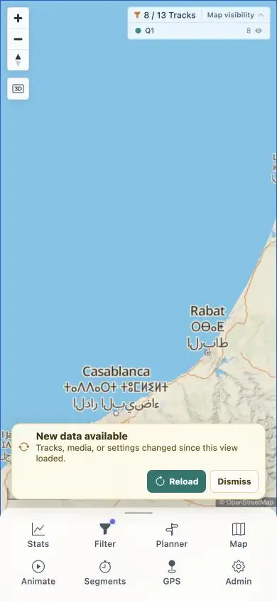

# Packet: MOB_05

## Scope

- Coverage source: [coverage-plan.md](../coverage-plan.md).
- Coverage ID or run packet: MOB_05.
- In scope: pinch, double-tap, and drag after mobile tool use.

## Prerequisites

- Required previous coverage IDs or run packets: MOB_04.
- Required app/data state: responsive map and Filter/Map/Segments tools.
- Required browser context: 390 x 844 pointer-only browser.

## Allowed Mutations

- Allowed: pointer double-click/drag after tools.
- Not allowed: claim pointer events as touch events.

## Actions And Results

| Coverage ID | Action | Expected result | Actual result | Status | Evidence |
|---|---|---|---|---|---|
| MOB_05 | Used pointer double-click and drag before and after Filter, Map, and Segments; audited touch capabilities. | Pinch, double-tap, and drag work after each tool. | Pointer gestures worked after each tool and zoomed 500→300→200→100→50 km. Native pinch/double-tap/touch-drag cannot execute or be attributed because the browser has no touch capability. | BLOCKED | [pointer map](../assets/MOB_05-pointer.webp), [sequence](../assets/MOB_05-gestures.txt) |

## Issues

No product issue created; touch capability is missing.

## Evidence Files

| File | Purpose |
|---|---|
| [assets/MOB_05-pointer.webp](../assets/MOB_05-pointer.webp) | Responsive map after pointer gesture/tool cycle. |
| [assets/MOB_05-gestures.txt](../assets/MOB_05-gestures.txt) | Per-tool scales and touch constraint. |

## Screenshot Evidence

## Timings

| Step | Timing |
|---|---:|
| Per pointer gesture settle | < 0.25 s |

## Handoff Notes

- Completed: MOB_05 is terminal `BLOCKED`.
- Remaining unfinished coverage: MOB_06 onward.
- Blocked or not applicable: native touch pinch/double-tap/drag needs a touch-capable harness.
- State left for the next packet: 390 x 844 map at 50 km scale.

