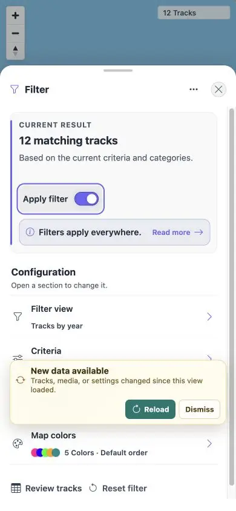

# Packet: MOB_06

## Scope

- Coverage source: [coverage-plan.md](../coverage-plan.md).
- Coverage ID or run packet: MOB_06.
- In scope: mobile Filter opening state, catalog-to-settings transition, and settings switch usability.

## Prerequisites

- Required previous coverage IDs or run packets: MOB_05.
- Required app/data state: Q1 filter baseline.
- Required browser context: 390 x 844 Filter flow.

## Allowed Mutations

- Allowed: select a temporary year view, toggle Apply filter, then restore Q1.
- Not allowed: leave the shared filter changed.

## Actions And Results

| Coverage ID | Action | Expected result | Actual result | Status | Evidence |
|---|---|---|---|---|---|
| MOB_06 | Opened Filter, selected Tracks by year from the catalog, toggled the returned settings switch, closed/reopened Filter, then restored quarter/Q1. | Openings start on Filters; selection opens Settings; Settings switch remains directly usable. | Every opening showed the Filter overview, catalog Apply returned to the settings overview, and Apply filter toggled true→false→true before any second selection. | PASS | [settings](../assets/MOB_06-settings.webp), [flow](../assets/MOB_06-flow.txt) |

## Issues

No issue found.

## Evidence Files

| File | Purpose |
|---|---|
| [assets/MOB_06-settings.webp](../assets/MOB_06-settings.webp) | Settings overview after catalog selection. |
| [assets/MOB_06-flow.txt](../assets/MOB_06-flow.txt) | Open/select/toggle/reopen/restore sequence. |

## Screenshot Evidence

## Timings

| Step | Timing |
|---|---:|
| Sheet transition | < 0.3 s |
| Switch toggle | < 0.2 s |

## Handoff Notes

- Completed: MOB_06 is terminal `PASS`.
- Remaining unfinished coverage: NET_01 onward.
- Blocked or not applicable: none in this packet.
- State left for the next packet: 390 x 844 Filter overview, Tracks by quarter, Q1 only, 8/12.

