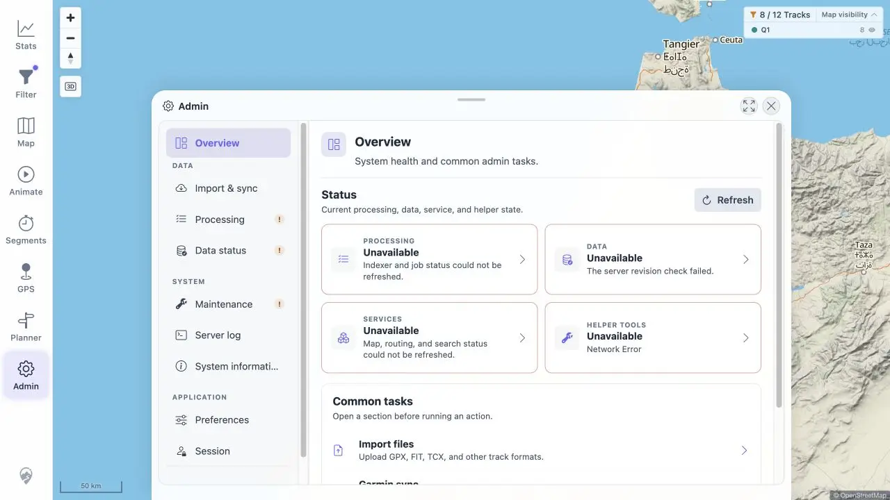
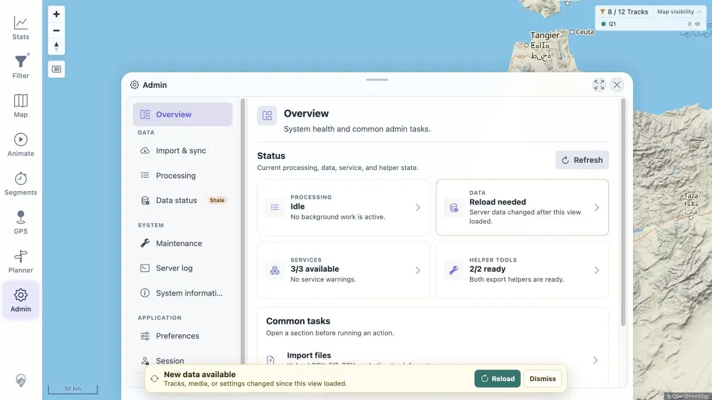

# Packet: NET_02

## Scope

- Coverage source: [coverage-plan.md](../coverage-plan.md).
- Coverage ID or run packet: NET_02.
- In scope: recoverable UI behavior during and after a flaky first-party connection.

## Prerequisites

- Required previous coverage IDs or run packets: NET_01.
- Required app/data state: healthy disposable Compose stack, signed-in Admin Overview, 12-track baseline.
- Required browser context: existing desktop SPA; no reload during the outage.

## Allowed Mutations

- Allowed: briefly stop and restart only the disposable Compose app service; use Admin Refresh.
- Not allowed: alter the database, sidecars, imported dataset, or shared host services.

## Actions And Results

| Coverage ID | Action | Expected result | Actual result | Status | Evidence |
|---|---|---|---|---|---|
| NET_02 | Stopped the disposable app service, refreshed Admin status in the already-loaded SPA, restarted the app, then retried the same action. | A flaky connection produces recoverable error states instead of a blank or frozen screen. | During the outage four status cards showed explicit `Unavailable`/`Network Error` states while the shell, map, navigation, common tasks, and Refresh remained usable. After restart, Refresh recovered Idle, Reload needed, 3/3 services available, and 2/2 helpers ready without a page reload. | PASS | [outage](../assets/NET_02-outage.webp), [recovered](../assets/NET_02-recovered.webp), [flow](../assets/NET_02-flow.txt) |

## Issues

No issue found.

## Evidence Files

| File | Purpose |
|---|---|
| [assets/NET_02-outage.webp](../assets/NET_02-outage.webp) | Explicit recoverable Admin error cards while the SPA remains usable. |
| [assets/NET_02-recovered.webp](../assets/NET_02-recovered.webp) | Same surface after service restoration and retry. |
| [assets/NET_02-flow.txt](../assets/NET_02-flow.txt) | Reversible outage, UI results, recovery, and timings. |

## Screenshot Evidence

## Timings

| Step | Timing |
|---|---:|
| Outage Refresh observation | 2.789 s |
| Recovery Refresh observation | 2.793 s |

## Handoff Notes

- Completed: NET_02 is terminal `PASS`.
- Remaining unfinished coverage: NET_03 onward.
- Blocked or not applicable: none in this packet.
- State left for the next packet: app restored and running; Admin Overview recovered; 12-track Q1 baseline unchanged.

