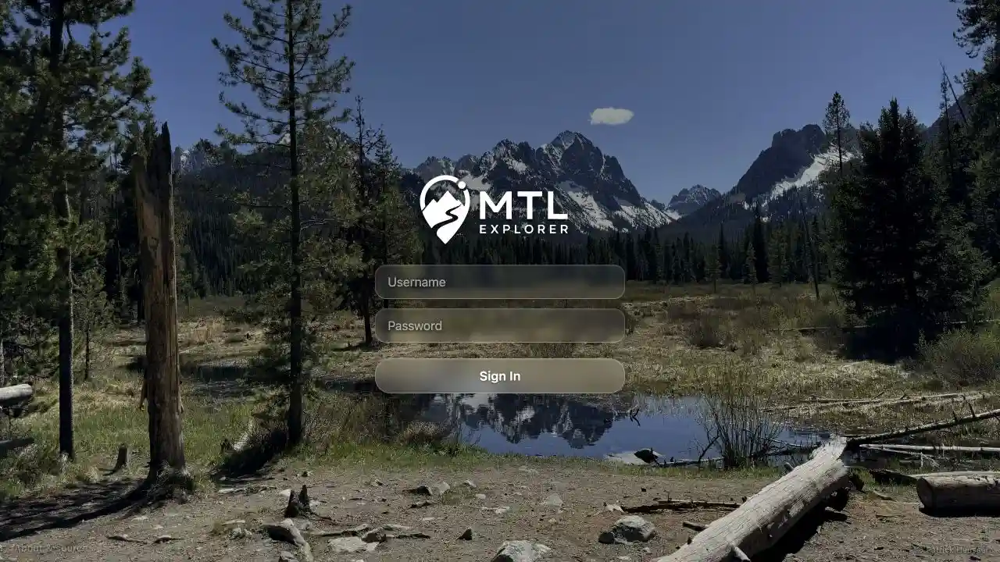

# Packet: NET_03

## Scope

- Coverage source: [coverage-plan.md](../coverage-plan.md).
- Coverage ID or run packet: NET_03.
- In scope: unauthorized first-party responses and protected-route redirection to login.

## Prerequisites

- Required previous coverage IDs or run packets: NET_02.
- Required app/data state: recovered healthy app and valid signed-in session.
- Required browser context: desktop target context.

## Allowed Mutations

- Allowed: credentials-only sign-out, direct protected-route navigation, sign-in.
- Not allowed: wipe local data or change account credentials.

## Actions And Results

| Coverage ID | Action | Expected result | Actual result | Status | Evidence |
|---|---|---|---|---|---|
| NET_03 | Signed out, confirmed three protected APIs return 401 unauthenticated, opened `/mtl/admin` directly, then signed in again. | A 401/403 condition redirects to login instead of exposing protected UI or a blank page. | All three protected APIs returned 401. Both normal sign-out and direct protected Admin navigation ended at a ready `/mtl/login` form. Valid sign-in restored the populated 8/12 Q1 map. | PASS | [login](../assets/NET_03-login.webp), [auth flow](../assets/NET_03-auth-flow.txt) |

## Issues

No issue found.

## Evidence Files

| File | Purpose |
|---|---|
| [assets/NET_03-login.webp](../assets/NET_03-login.webp) | Ready login UI after direct protected-route navigation while unauthorized. |
| [assets/NET_03-auth-flow.txt](../assets/NET_03-auth-flow.txt) | 401 results, redirect path, and successful recovery. |

## Screenshot Evidence

## Timings

| Step | Timing |
|---|---:|
| Direct protected-route redirect | < 1.0 s |
| Sign-in click to populated map | 3.676 s |

## Handoff Notes

- Completed: NET_03 is terminal `PASS`.
- Remaining unfinished coverage: NET_04 onward.
- Blocked or not applicable: no 403 path is exposed by the configured single-role quick-install account; the required unauthorized path was exercised as 401.
- State left for the next packet: signed in on the populated 8/12 Q1 map.

