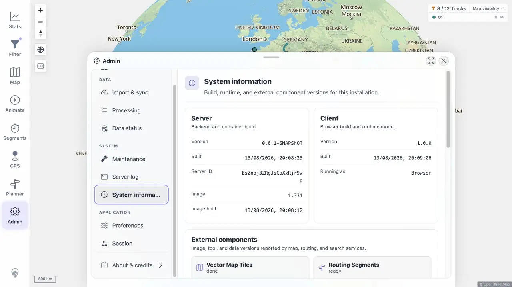

# Packet: NET_04

## Scope

- Coverage source: [coverage-plan.md](../coverage-plan.md).
- Coverage ID or run packet: NET_04.
- In scope: service-worker update detection, prompt acceptance, and clean reload when a worker can run.

## Prerequisites

- Required previous coverage IDs or run packets: NET_03.
- Required app/data state: healthy signed-in app using the required image.
- Required browser context: configured remote origin.

## Allowed Mutations

- Allowed: inspect origin protocol, runtime mode, and the static worker response.
- Not allowed: replace the required image, add TLS not present in the target, or claim an update flow without an active service worker.

## Actions And Results

| Coverage ID | Action | Expected result | Actual result | Status | Evidence |
|---|---|---|---|---|---|
| NET_04 | Checked the target protocol, Admin client runtime mode, display mode, and `/mtl/sw.js` response before attempting an update. | With an active service worker, a new version is announced and accepting it reloads cleanly. | The remote target is non-loopback plain HTTP and Admin reports `Running as: Browser`. Although the static worker file is served, this origin cannot provide the secure context required to register and activate it. No waiting-worker update flow can exist in this configured context. | NOT APPLICABLE | [runtime](../assets/NET_04-runtime.webp), [eligibility](../assets/NET_04-runtime.txt) |

## Issues

No issue found.

## Evidence Files

| File | Purpose |
|---|---|
| [assets/NET_04-runtime.webp](../assets/NET_04-runtime.webp) | Admin client build and `Running as: Browser` runtime evidence. |
| [assets/NET_04-runtime.txt](../assets/NET_04-runtime.txt) | Origin, display mode, worker response, and secure-context classification. |

## Screenshot Evidence

## Timings

| Step | Timing |
|---|---:|
| Runtime inspection | < 1.0 s |
| Worker asset response | < 0.2 s |

## Handoff Notes

- Completed: NET_04 is terminal `NOT APPLICABLE`.
- Remaining unfinished coverage: ERR_01 onward.
- Blocked or not applicable: service-worker update behavior is not applicable on the configured non-loopback HTTP origin.
- State left for the next packet: healthy signed-in Admin System information, Q1 baseline unchanged.

