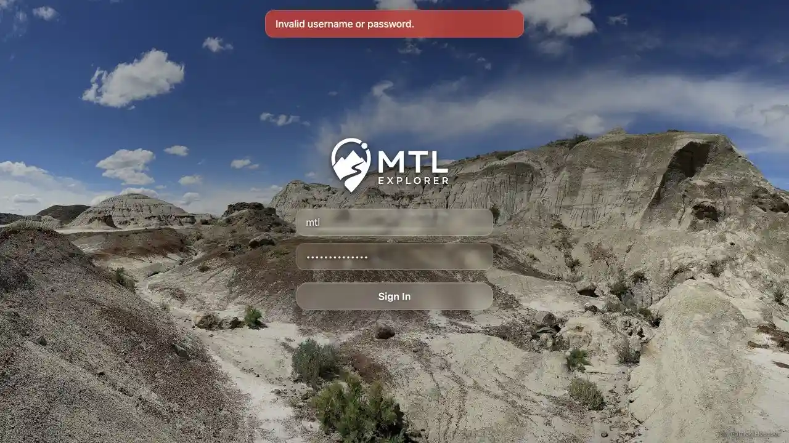

# Packet: SGN_03

## Scope

- Coverage source: [coverage-plan.md](../coverage-plan.md).
- Coverage ID or run packet: SGN_03.
- In scope: submit an invalid password.
- Out of scope: rate limiting and account lockout.

## Prerequisites

- Required previous coverage IDs or run packets: SGN_02.
- Required app/data state: healthy authentication service.
- Required browser context: credentials-only sign-out followed by the login screen.

## Allowed Mutations

- Allowed: one invalid login attempt.
- Not allowed: change stored credentials.

## Actions And Results

| Coverage ID | Action | Expected result | Actual result | Status | Evidence |
|---|---|---|---|---|---|
| SGN_03 | Submitted username `mtl` with an invalid password. | A clear error appears and the browser stays on login. | An alert stated `Invalid username or password.`; the final URL remained `/mtl/login` and the form became ready for another attempt. | PASS | [assets/SGN_03-invalid-credentials.webp](../assets/SGN_03-invalid-credentials.webp) |

## Issues

| ID | Severity | Summary | Reproduction | Expected | Actual | Evidence | Release impact |
|---|---|---|---|---|---|---|---|

## Evidence Files

| File | Purpose |
|---|---|
| [assets/SGN_03-invalid-credentials.webp](../assets/SGN_03-invalid-credentials.webp) | Invalid-credential alert on the retained login screen. |

## Screenshot Evidence

## Timings

| Step | Timing |
|---|---:|
| Invalid attempt to error | < 1 s |

## Handoff Notes

- Completed: invalid-credential handling.
- Remaining unfinished coverage: SGN_04 onward.
- Blocked or not applicable: none.
- State left for the next packet: signed out on login after the invalid attempt.
