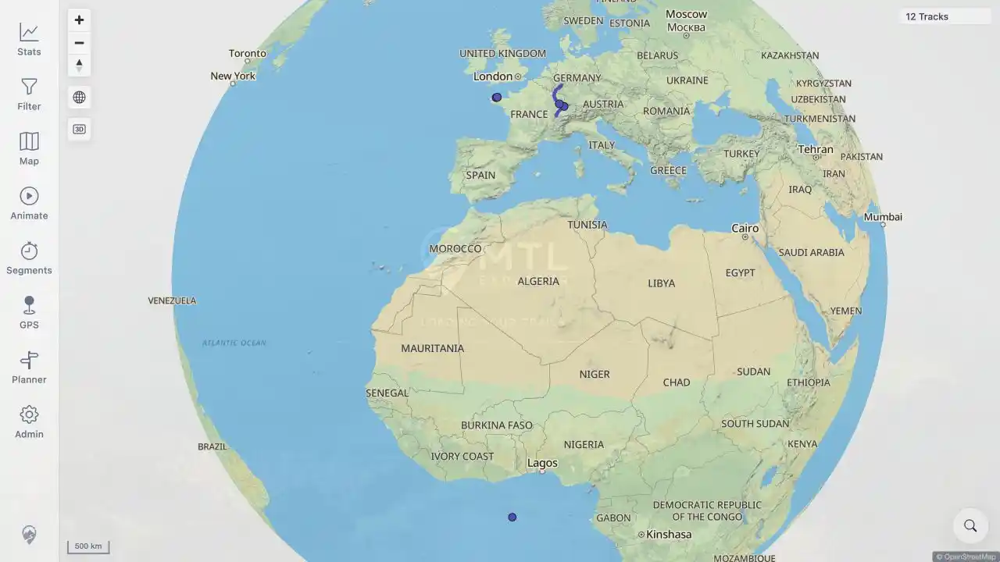

# Packet: SGN_06

## Scope

- Coverage source: [coverage-plan.md](../coverage-plan.md).
- Coverage ID or run packet: SGN_06.
- In scope: observe the startup splash and its removal after map/data load.
- Out of scope: startup failure handling.

## Prerequisites

- Required previous coverage IDs or run packets: SGN_05.
- Required app/data state: signed-in session with 12 tracks.
- Required browser context: desktop browser on the map.

## Allowed Mutations

- Allowed: reload the application.
- Not allowed: stop the server in this packet.

## Actions And Results

| Coverage ID | Action | Expected result | Actual result | Status | Evidence |
|---|---|---|---|---|---|
| SGN_06 | Reloaded the signed-in app; captured the first post-load paint and the settled view. | Branded splash with message displays during startup, then disappears after map/tracks load. | At 234 ms, the MTL Explorer logo and `Loading your trails` message were visible. After 1.8 s, the splash was absent and the map showed 12 tracks. | PASS | [assets/SGN_06-splash.webp](../assets/SGN_06-splash.webp); [assets/SGN_06-loaded.webp](../assets/SGN_06-loaded.webp) |

## Issues

| ID | Severity | Summary | Reproduction | Expected | Actual | Evidence | Release impact |
|---|---|---|---|---|---|---|---|

## Evidence Files

| File | Purpose |
|---|---|
| [assets/SGN_06-splash.webp](../assets/SGN_06-splash.webp) | Startup logo and loading message. |
| [assets/SGN_06-loaded.webp](../assets/SGN_06-loaded.webp) | Settled map after the splash disappeared. |

## Screenshot Evidence

## Timings

| Step | Timing |
|---|---:|
| Reload to splash capture | 234 ms |
| Splash capture to settled map | 1.8 s |

## Handoff Notes

- Completed: successful-startup splash lifecycle.
- Remaining unfinished coverage: SGN_07 onward.
- Blocked or not applicable: none.
- State left for the next packet: signed-in 12-track map.
