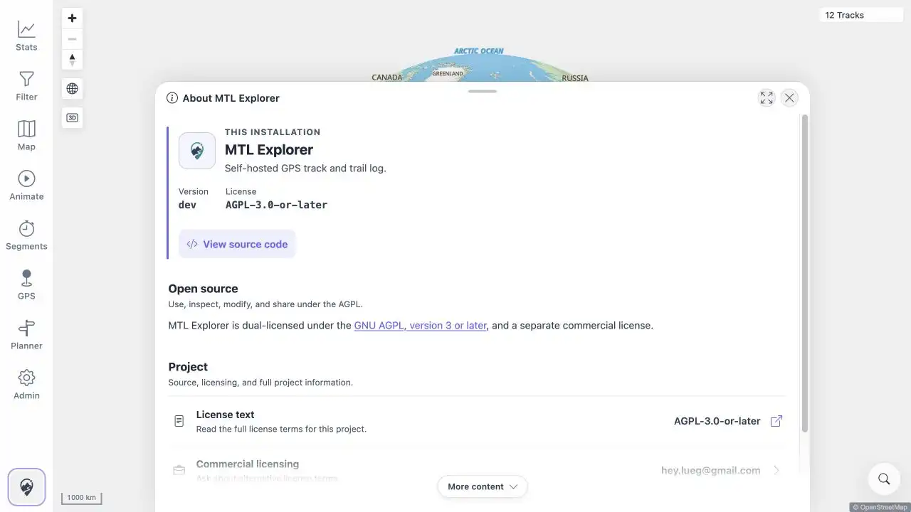

# Packet: SGN_08

## Scope

- Coverage source: [coverage-plan.md](../coverage-plan.md).
- Coverage ID or run packet: SGN_08.
- In scope: verify MTL Explorer branding in public-facing UI.
- Out of scope: inspect internal code identifiers.

## Prerequisites

- Required previous coverage IDs or run packets: SGN_07.
- Required app/data state: healthy restored app.
- Required browser context: signed-in desktop map.

## Allowed Mutations

- Allowed: open About.
- Not allowed: change application settings.

## Actions And Results

| Coverage ID | Action | Expected result | Actual result | Status | Evidence |
|---|---|---|---|---|---|
| SGN_08 | Opened the public About surface and inspected its title and installation copy. | `MTL Explorer` branding appears in About/public-facing copy. | The launcher reads `About MTL Explorer`; the sheet heading and logo read `MTL Explorer`, followed by public installation and license copy. | PASS | [assets/SGN_08-branding.webp](../assets/SGN_08-branding.webp) |

## Issues

| ID | Severity | Summary | Reproduction | Expected | Actual | Evidence | Release impact |
|---|---|---|---|---|---|---|---|

## Evidence Files

| File | Purpose |
|---|---|
| [assets/SGN_08-branding.webp](../assets/SGN_08-branding.webp) | Public About sheet with MTL Explorer branding. |

## Screenshot Evidence

## Timings

| Step | Timing |
|---|---:|
| Open and inspect About | < 1 s |

## Handoff Notes

- Completed: public branding check.
- Remaining unfinished coverage: SGN_09 onward.
- Blocked or not applicable: none.
- State left for the next packet: About sheet open over the signed-in map.
