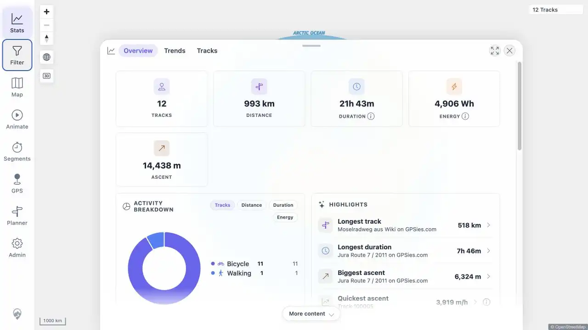
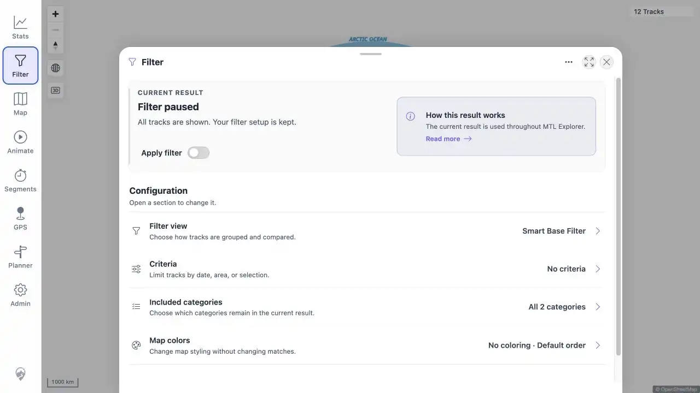

# Packet: SGN_09

## Scope

- Coverage source: [coverage-plan.md](../coverage-plan.md).
- Coverage ID or run packet: SGN_09.
- In scope: browser history navigation between application views.
- Out of scope: external-site history.

## Prerequisites

- Required previous coverage IDs or run packets: SGN_08.
- Required app/data state: healthy 12-track map.
- Required browser context: signed-in desktop browser.

## Allowed Mutations

- Allowed: open Stats and Filter, then use browser back and forward.
- Not allowed: mutate filter criteria.

## Actions And Results

| Coverage ID | Action | Expected result | Actual result | Status | Evidence |
|---|---|---|---|---|---|
| SGN_09 | Navigated root → Stats → Filter, selected browser Back, then Forward. | Back/forward restores the corresponding application views without errors. | Back restored `/mtl/stats` with the statistics controls; Forward restored `/mtl/filter` with the Filter heading. No error surface appeared. | PASS | [assets/SGN_09-back-stats.webp](../assets/SGN_09-back-stats.webp); [assets/SGN_09-forward-filter.webp](../assets/SGN_09-forward-filter.webp) |

## Issues

| ID | Severity | Summary | Reproduction | Expected | Actual | Evidence | Release impact |
|---|---|---|---|---|---|---|---|

## Evidence Files

| File | Purpose |
|---|---|
| [assets/SGN_09-back-stats.webp](../assets/SGN_09-back-stats.webp) | Stats restored by browser Back. |
| [assets/SGN_09-forward-filter.webp](../assets/SGN_09-forward-filter.webp) | Filter restored by browser Forward. |

## Screenshot Evidence

## Timings

| Step | Timing |
|---|---:|
| Back to settled Stats | < 1 s |
| Forward to settled Filter | < 1 s |

## Handoff Notes

- Completed: back/forward navigation between two real views.
- Remaining unfinished coverage: MAP_01 onward.
- Blocked or not applicable: none.
- State left for the next packet: Filter sheet open over the 12-track map.
