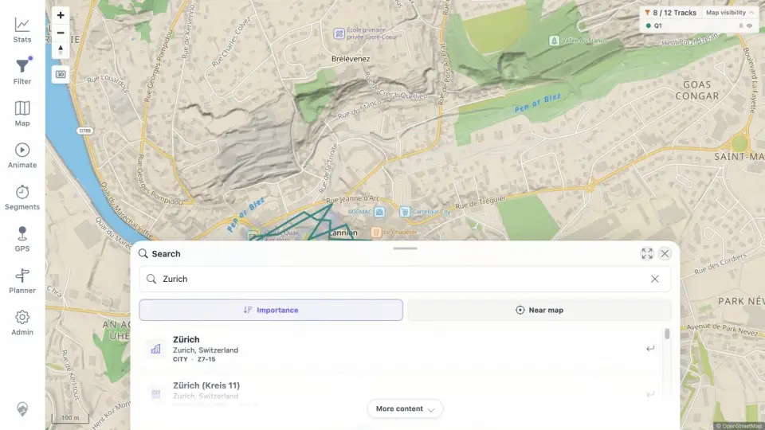

# Packet: SRC_01

## Scope

- Coverage source: [coverage-plan.md](../coverage-plan.md).
- Coverage ID or run packet: SRC_01.
- In scope: opening location search and receiving place-name results.
- Out of scope: result selection and marker cleanup.

## Prerequisites

- Required previous coverage IDs or run packets: GPS_05.
- Required app/data state: location-search sidecar healthy.
- Required browser context: signed-in desktop map.

## Allowed Mutations

- Allowed: enter a place query.
- Not allowed: change track/filter data.

## Actions And Results

| Coverage ID | Action | Expected result | Actual result | Status | Evidence |
|---|---|---|---|---|---|
| SRC_01 | Opened location search and typed `Zurich`. | Place-name results appear. | A populated result sheet appeared with Zürich and many district/neighborhood matches, types, and zoom ranges. | PASS | [results](../assets/SRC_01-results.webp), [examples](../assets/SRC_01-results.txt) |

## Issues

No issue found.

## Evidence Files

| File | Purpose |
|---|---|
| [assets/SRC_01-results.webp](../assets/SRC_01-results.webp) | Populated Zurich result sheet. |
| [assets/SRC_01-results.txt](../assets/SRC_01-results.txt) | Representative place results and metadata. |

## Screenshot Evidence

## Timings

| Step | Timing |
|---|---:|
| Query to results | 0.8 s |

## Handoff Notes

- Completed: SRC_01 is terminal `PASS`.
- Remaining unfinished coverage: SRC_02 onward.
- Blocked or not applicable: none in this packet.
- State left for the next packet: Zurich results open; no result selected yet.
