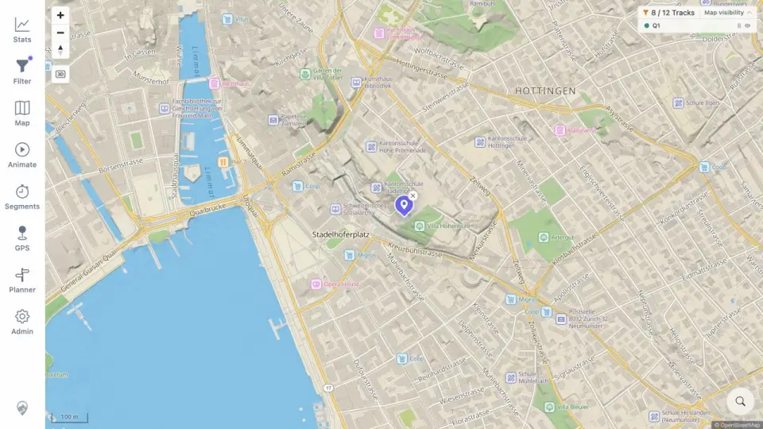

# Packet: SRC_02

## Scope

- Coverage source: [coverage-plan.md](../coverage-plan.md).
- Coverage ID or run packet: SRC_02.
- In scope: result selection, map movement, and marker placement.
- Out of scope: marker cleanup.

## Prerequisites

- Required previous coverage IDs or run packets: SRC_01.
- Required app/data state: Zurich result list open.
- Required browser context: desktop map.

## Allowed Mutations

- Allowed: select the Zürich result.
- Not allowed: change filter or track data.

## Actions And Results

| Coverage ID | Action | Expected result | Actual result | Status | Evidence |
|---|---|---|---|---|---|
| SRC_02 | Selected the exact Zürich city result. | Map flies to the result and places a marker. | Search closed, map moved to a 100 m view, and a centered purple removable location marker appeared. | PASS | [marker](../assets/SRC_02-marker.webp), [selection](../assets/SRC_02-marker.txt) |

## Issues

No issue found.

## Evidence Files

| File | Purpose |
|---|---|
| [assets/SRC_02-marker.webp](../assets/SRC_02-marker.webp) | Centered result marker after map flight. |
| [assets/SRC_02-marker.txt](../assets/SRC_02-marker.txt) | Selected identity and post-selection state. |

## Screenshot Evidence

## Timings

| Step | Timing |
|---|---:|
| Result selection to settled marker | 0.85 s |

## Handoff Notes

- Completed: SRC_02 is terminal `PASS`.
- Remaining unfinished coverage: SRC_03 onward.
- Blocked or not applicable: none in this packet.
- State left for the next packet: Zürich marker visible with remove X.
