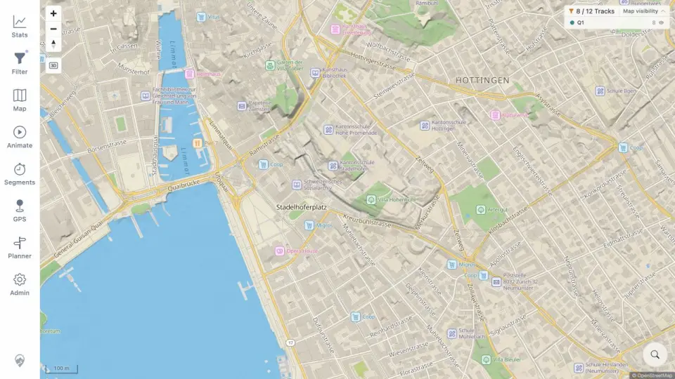

# Packet: SRC_03

## Scope

- Coverage source: [coverage-plan.md](../coverage-plan.md).
- Coverage ID or run packet: SRC_03.
- In scope: selected search-marker cleanup.
- Out of scope: empty/no-result messages.

## Prerequisites

- Required previous coverage IDs or run packets: SRC_02.
- Required app/data state: Zürich marker visible.
- Required browser context: desktop map.

## Allowed Mutations

- Allowed: invoke the marker remove control.
- Not allowed: change map location or filter.

## Actions And Results

| Coverage ID | Action | Expected result | Actual result | Status | Evidence |
|---|---|---|---|---|---|
| SRC_03 | Clicked the X attached to the selected-place marker. | Clearing search or choosing another tool removes the marker cleanly. | Marker/X disappeared with no orphan surface; the normal Zürich map and controls remained usable. | PASS | [cleared map](../assets/SRC_03-cleared.webp), [cleanup](../assets/SRC_03-cleared.txt) |

## Issues

No issue found.

## Evidence Files

| File | Purpose |
|---|---|
| [assets/SRC_03-cleared.webp](../assets/SRC_03-cleared.webp) | Same selected map view without the marker. |
| [assets/SRC_03-cleared.txt](../assets/SRC_03-cleared.txt) | Exact cleanup transition. |

## Screenshot Evidence

## Timings

| Step | Timing |
|---|---:|
| Marker removal | < 0.45 s |

## Handoff Notes

- Completed: SRC_03 is terminal `PASS`.
- Remaining unfinished coverage: SRC_04 onward.
- Blocked or not applicable: none in this packet.
- State left for the next packet: Zürich map at 100 m, no search marker.
