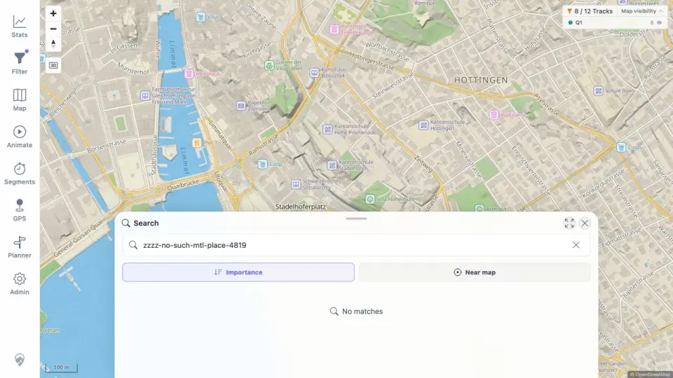

# Packet: SRC_04

## Scope

- Coverage source: [coverage-plan.md](../coverage-plan.md).
- Coverage ID or run packet: SRC_04.
- In scope: empty and no-result search feedback.
- Out of scope: successful result selection already covered.

## Prerequisites

- Required previous coverage IDs or run packets: SRC_03.
- Required app/data state: search marker cleared.
- Required browser context: desktop map.

## Allowed Mutations

- Allowed: enter a guaranteed-miss query and clear it.
- Not allowed: change search service data.

## Actions And Results

| Coverage ID | Action | Expected result | Actual result | Status | Evidence |
|---|---|---|---|---|---|
| SRC_04 | Entered a guaranteed-miss string, observed the result, then cleared the input. | Empty/no-result queries show a clear message. | Both states showed `No matches`; no stale successful result, spinner, or blank sheet remained. | PASS | [no results](../assets/SRC_04-no-results.webp), [states](../assets/SRC_04-no-results.txt) |

## Issues

No issue found.

## Evidence Files

| File | Purpose |
|---|---|
| [assets/SRC_04-no-results.webp](../assets/SRC_04-no-results.webp) | Clear no-result search surface. |
| [assets/SRC_04-no-results.txt](../assets/SRC_04-no-results.txt) | Miss and empty-query outcomes. |

## Screenshot Evidence

## Timings

| Step | Timing |
|---|---:|
| Miss query | 0.75 s |
| Empty state | 0.35 s |

## Handoff Notes

- Completed: SRC_04 is terminal `PASS`.
- Remaining unfinished coverage: GLB_01 onward.
- Blocked or not applicable: none in this packet.
- State left for the next packet: Search open with empty input and `No matches`; Zürich map underneath.
